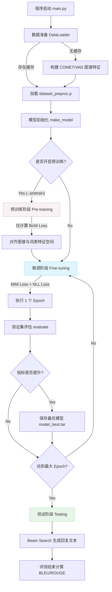

# CASE 模型总体训练流水线 (Training Pipeline)

本文档整理了 CASE (Coarse-to-Fine Cognition and Affection model) 模型的整体工程工作流与数据流转过程，主要基于 `main.py` 及 `model.py` 的核心实现。

## 1. 数据准备与预处理 (Data Preparation)

*   **入口函数**: `src.utils.data.loader.prepare_data_seq()`
*   **执行逻辑**:
    1. 检查是否存在持久化缓存文件 (`dataset_preproc.p`)。若存在，直接反序列化加载（耗时约 15-20 秒）。
    2. 若不存在，读取原始 `.npy` 和文本数据，调用外部的 `comet-atomic-2020` 模型生成认知图谱节点，并利用 ConceptNet/VAD 生成情感图谱特征，最终序列化保存。
    3. 实例化全局词表 (Vocab)。
    4. 封装 `Dataset` 并构造 PyTorch 的 `DataLoader`（包含 Train / Valid / Test 划分）。

## 2. 模型初始化 (Model Initialization)

*   **入口函数**: `main.py` -> `make_model()`
*   **架构构建**:
    1. 实例化 `CASE` 主类。
    2. 加载预训练的 GloVe 词向量 (`vectors/glove.6B.300d.txt`)，构建统一的 `Embedding` 层。
    3. 初始化核心组件：
        *   **上下文编码器 (Context Encoder)**
        *   **认知图谱编码器 (cs_graph_encoder)**：处理 COMET 关系
        *   **情感图谱编码器 (concept_graph_encoder)**：处理 ConceptNet/VAD 节点
        *   **解码器 (Decoder)**：用于最终文本生成

## 3. 预训练阶段 (Pre-training Phase)

*   **触发条件**: 命令行参数 `--pretrain` 且 `--pretrain_epoch > 0`
*   **入口函数**: `main.py` -> `pretrain()`
*   **执行逻辑**:
    1. **目的**: 实现从“粗粒度 (Coarse-grained)”外部知识到文本表示的初始对齐。
    2. **损失函数**: 不计算完整的序列生成损失，而是计算 **Bag-of-Words (BoW) Loss**（词袋损失）。
    3. **机制**: 强制让 `cs_graph_encoder` 和 `concept_graph_encoder` 输出的隐变量（隐含层状态）能够预测出目标回复（Target）中存在的单词集合。
    4. **产出**: 在正式让模型逐词“说话”前，先确保其“脑内”的知识图谱表征具有正确的语义方向。

## 4. 微调训练阶段 (Fine-tuning Phase)

*   **入口函数**: `main.py` -> `train()`
*   **执行逻辑**:
    1. **目的**: 优化模型的逐词序列生成能力。
    2. **核心调用**: `model.train_one_batch()`
    3. **前向传播与损失**:
        *   将上下文与图谱特征融合 (`emotion_enc = emo_gate * concept_enc + (1 - emo_gate) * fine_emotion`)。
        *   **MIM 损失**: 在同一个 Batch 内计算互信息最大化 (Mutual Information Maximization) 损失，拉近局部特征。
        *   **生成损失**: 计算标准的 NLL (Negative Log-Likelihood) 损失，用于自回归解码。
    4. **混合精度与累加**: 目前已植入 AMP (`autocast`) 与梯度累加（`accum_steps=4`），在此阶段生效，确保在 4GB 显存下平稳运行。
    5. **评估与早停**: 每个 Epoch 结束时，调用 `evaluate()` 在验证集 (Valid Set) 上测试指标（如 PPL、Loss）。若性能提升，则保存当前模型权重 (`model_best.tar`)。

## 5. 测试与推理阶段 (Testing & Inference)

*   **入口函数**: 测试流在 `train()` 结束后自动执行，或直接加载预训练模型权重。
*   **执行逻辑**:
    1. 冻结所有梯度 (`torch.no_grad()`)。
    2. 使用 `Beam Search` 或 `Greedy Search` 生成目标响应文本。
    3. 将生成的回复保存为文本文件，供后续评测脚本（如 BLEU, ROUGE, Distinct 等）计算量化指标。

## 6. 核心流程图解 (Flowchart)

---

**EPCL 集成切入点评估**:
根据上述流程，我们计划植入的 **EPCL (Emotion Prototype Contrastive Learning)** 模块，主要发生于 **第 4 阶段 (微调阶段)** 的前向传播中。EPCL 将锚定在 `emotion_enc` 表征融合后，增加一个特征投影维度，并在 Global 层面施加 Prototype Contrastive Loss，以辅助现有的 MIM 机制。
