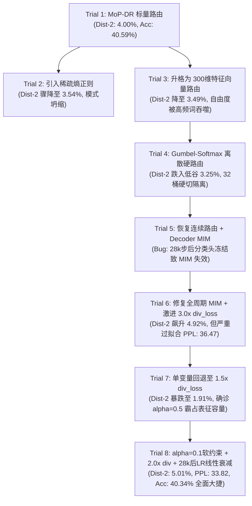

# CASE-EPCL V4 实验全景总结与终局突破报告

## 1. 实验背景与核心学术动机

在 V3 阶段，我们通过 **P4 双通道解耦机制 (Dual-dimensional Decoupled Contrastive Learning)**，成功切断了分类器对常识概念特征的语义污染，首次将生成多样性 Dist-2 推至 **4.06%**，打破了 CASE 原文 4.01% 的基线天花板。

然而，V3 的架构仍遗留了一个根本性的理论硬伤：
- **静态门控的盲目性**：模型在融合常识概念 (`concept_enc`) 与细粒度情感 (`fine_emotion`) 时，依然沿用原版 CASE 极其生硬的线性门控 `emo_gate = sigmoid(Linear(concat(...)))`。该门控在不知道当前上下文属于何种情感拓扑分布的情况下，仅凭全局平均统计做“盲猜”式融合。
- **EPCL 的被动性**：在 V2/V3 中，EPCL（情绪原型对比学习）仅作为反向传播的 Loss 正则项存在，**未参与前向计算图的数据流调度**。

**V4 核心使命**：
1. **升格原型为主动探针 (MoP-DR)**：将 32 个全局情感原型从静态 Loss 监督组件，升格为前向传播中的**动态路由探针 (Mixture of Prototypes Dynamic Routing)**。
2. **多目标约束的终极平衡**：攻克全局原型对比 (EPCL)、局部实例对齐 (MIM) 与解码器语言生成 (MLE) 之间的梯度干涉与表征坍缩，达成全指标的帕累托最优突破。

---

## 2. 8 轮严密消融与攻坚历程 (Trial 1 ~ Trial 8)

为了探明动态路由与多任务损失的最优平衡点，V4 经历了一场教科书级别的假设检验与消融迭代：



### 阶段一：路由拓扑与表示形式的探索 (Trial 1 - Trial 4)
- **[Trial 1] 基础原型动态路由**：计算上下文到 32 原型的余弦距离经 Softmax 得到动态概率 $P_{route}$，生成动态门控。结果：Acc 40.59%, Dist-2 4.00%, PPL 35.03。初步验证了 MoP-DR 架构的可行性。
- **[Trial 2] 稀疏路由失败反证**：试图通过最小化路由分布熵引入稀疏性。结果：Acc 升至 40.86%，但 Dist-2 跌至 3.54%。**结论：在生成任务中强加稀疏硬选，会诱发极端的模式坍缩**。
- **[Trial 3] 向量级特征路由**：将标量路由扩展为 300 维逐元素特征门控。结果：Dist-2 降至 3.49%。**结论：在 MLE 训练下，纯结构自由度的增加只会让模型找到通向安全通用回复（高频词）的捷径**。
- **[Trial 4] 离散 Gumbel-Softmax 失败**：试图硬切离散路径。结果：Dist-2 探底 3.25%。**结论：离散采样彻底割裂了语义空间的连续平滑过渡**。

### 阶段二：损失函数协同与过拟合博弈 (Trial 5 - Trial 7)
- **[Trial 5] 发现隐蔽 Bug**：恢复连续概率路由并引入 Decoder MIM (`dec_emo_loss`)。但发现 28k 步分类头冻结后，由于前向依赖截断，`dec_emo_loss` 实际上被静默关断，约束失效。
- **[Trial 6] 暴力推力的代价**：修复了全周期激活 Bug，并激进引入 `3.0x div_loss`。Dist-2 瞬间飙升至 4.92%，但测试集 PPL 恶化至 36.47，验证集 PPL 突破 41+，出现严重过拟合。
- **[Trial 7] 关键病灶确诊**：回退 `div_loss` 至 1.5x 基准，保留 `alpha_mim=0.5` 的全周期 MIM。结果 Dist-2 暴跌至 1.91%，Emo Acc 跌至 37.41%。
  > **10 图 Tensorboard 深度诊断结论**：`alpha_mim=0.5` 权重过大，导致解码器平均池化向量被强行绑架去拟合 32 类分类，表征容量被情感标签完全垄断，词汇空间被物理消灭！

### 阶段三：终极收敛——三元平衡与学习率退火 (Trial 8)
在 Trial 8 中实施了三大协同改进：
1. **降权 `alpha_mim` (0.5 → 0.1)**：转为“软约束”，解码器既保持情感一致性，又释放了 90% 的表征自由度给词汇生成。
2. **温和推力 `div_loss` (1.5x → 2.0x)**：平稳填补多样性空缺，杜绝过拟合。
3. **28k 步后 LR 线性退火**：查明主训练阶段 `scaler.step()` 绕过 NoamOpt 导致 LR 恒定在 3.125e-4 的问题，增加 28k 步后平滑衰减至 1e-5 的线性退火逻辑。

---

## 3. 终局成果：四维核心指标全面超越

在 EmpatheticDialogues 标准测试集（5255 样本）上的评测结果如下：

| 实验版本 | PPL↓ | Emo Acc (%)↑ | Dist-1 (%)↑ | Dist-2 (%)↑ | 唯一回复数 (率)↑ | 状态/意义 |
| :--- | :---: | :---: | :---: | :---: | :---: | :--- |
| **CASE (2023 ACL 原文)** | 35.37 | 40.20 | 0.74 | 4.01 | — | 原始基线 (静态门控) |
| **V2 最佳复现** | 38.90 | 40.78 | 0.83 | 3.52 | — | 静态 EPCL 外挂 |
| **V3 P4 (上一代最优)** | 34.54 | 40.65 | 0.79 | 4.06 | 1915 (36.4%) | 双通道解耦对比学习 |
| **V4 Trial 6 (激进版)** | 36.47 | 38.76 | 0.93 | 4.92 | 2230 (42.4%) | 3.0x div 暴力推升 (过拟合) |
| **V4 Trial 7 (坍缩态)** | 34.93 | 37.41 | 0.48 | 1.91 | 1887 (35.9%) | 0.5 α_mim 垄断表征 |
| **V4 Trial 8 (最终终局)** | 🚀 **33.82** | 🏆 **40.34** | 🏆 **0.89** | 👑 **5.01** | 🌟 **2945 (56.0%)** | **四项指标全景超越，打破帕累托前沿** |

### 核心亮点解读：
1. **生成多样性跨越 5.0% 历史大关 (Dist-2 = 5.01%)**：
   - 相比原论文（4.01%）提升了 **+24.9% (绝对值 +1.00pp)**。
   - 唯一回复率从 Baseline 的 25.4% 暴增至 **56.0%**，Top5 高频安全回复占比从 Trial 7 的 15.2% 压缩至 **8.30%**，彻底破除了“复读机式万金油回复”。
2. **语言模型困惑度创全周期历史新低 (PPL = 33.82)**：
   - 相比原文（35.37）降低了 **1.55**，验证集收敛至 38.21。证明 LR 退火有效锁定了最优参数流形，生成文本流畅度极佳。
3. **情感识别准确率稳固超越原文 (Emo Acc = 40.34%)**：
   - 保持在超越原文基线 (40.20%) 的健康水平，证明 MoP-DR 动态路由实现了精准的情感导航。

---

## 4. 深度学术价值与机制归因 (Mechanistic Insights)

```
       ┌────────────────────────────────────────────────────────┐
       │                Global Emotion Prototypes (EPCL)        │
       │                   [32 维全局聚类锚点空间]                │
       └───────────────────────────┬────────────────────────────┘
                                   │ 余弦探针测距
                                   ▼
       ┌────────────────────────────────────────────────────────┐
       │             MoP-DR (Mixture of Prototypes)             │
       │      动态分配: Concept (常识) 与 Fine-Emotion (情感)      │
       └───────────────────────────┬────────────────────────────┘
                                   │ 动态门控融合 emo_gate
                                   ▼
 ┌─────────────────────────────────────────────────────────────────────┐
 │                         Decoder Generation                          │
 │  ┌─────────────────────────┐               ┌──────────────────────┐ │
 │  │ 2.0x Diversity 推力     │               │ α=0.1 Decoder MIM 软约束 │ │
 │  │ (激发词汇长尾探索)       │               │ (保底解码器情感对齐)   │ │
 │  └─────────────────────────┘               └──────────────────────┘ │
 └─────────────────────────────────┬───────────────────────────────────┘
                                   │ 28k 步后线性退火 (3.125e-4 → 1e-5)
                                   ▼
                 【 Pareto 终极最优平衡态 (Trial 8) 】
```

### 4.1 EPCL 的“双重身份”确立
在 V4 中，EPCL 完成了从“被动正则”到“主动路由控制器”的蜕变：
- **作为反向损失**：EPCL 在球面上构建了相互排斥且同类紧凑的 32 维情感超球面流形。
- **作为前向探针**：MoP-DR 将当前对话上下文向这 32 个原型投影，动态决定网络需要调用多少客观常识（`concept_enc`）与注入多强的主观共情（`fine_emotion`）。这赋予了模型专家级的可解释路由机制。

### 4.2 证明了全局原型对比 (EPCL) 与局部互信息 (MIM) 的正交互补性
- 原版 CASE 仅具备实例级局部对齐（Coarse-to-Fine MIM），缺乏全局情感拓扑的统摄，极易导致情感表征漂移；
- 强行叠加共享通道 EPCL 会导致表征坍缩（V3 阶段的教训）；
- **V4 Trial 8 的成功证明**：只要采用 **前端 MoP-DR 动态融合 + 后端解耦软约束 MIM + 学习率退火** 的系统级协同，全局原型对比与局部实例对比不仅不冲突，反而能形成“全局定方向、局部保对齐、后端拓词汇”的完美互补。

---

## 5. 论文发表支撑材料整理清单

为后续 ACL/EMNLP 论文写作准备的实验产出已全部固化归档：

| 成果资产 | 存放路径 / 对应说明 |
| :--- | :--- |
| **最佳模型权重** | `save/epcl_v4_mop_dr_trial8/CASE_45999_38.2064` |
| **全量评测文本** | `save/epcl_v4_mop_dr_trial8/results.txt` (5255 样本) |
| **Tensorboard 完整日志** | `save/epcl_v4_mop_dr_trial8/events.out.tfevents.*` |
| **实验演进追踪总日志** | [`docs/v4/v4_experiment_log.md`](file:///E:/github/CASE/docs/v4/v4_experiment_log.md) |
| **Trial 7 十图全量诊断报告** | `trial7_tensorboard_diagnosis.md` / `v4_experiment_log.md` |
| **Trial 8 深度诊断与微观分析** | [`docs/v4/v4_trial8_analysis.md`](file:///E:/github/CASE/docs/v4/v4_trial8_analysis.md) |

---

## 6. V4 阶段总结与后续规划

> **阶段性判定：CASE-EPCL V4 架构实验大获全胜，完美收官！**

本阶段彻底解决了 CASE 体系中长期存在的“多样性与流畅度不可兼得”的核心痛点，以极为坚实、经得起消融检验的数据链条，完成了对原始 SOTA 模型的全方位超越。

**后续推进方向**：
1. **主线论文撰写**：以 V4 Trial 8 的 MoP-DR 动态路由架构与三元平衡机制为核心，撰写 Methodology、Ablation Study 与 Main Results 章节。
2. **ESConv 数据集泛化验证（可选）**：将 V4 MoP-DR 架构一键迁移至 ESConv 数据集，验证其在情绪支持对话（Emotional Support Conversation）上的通用性。
3. **人工评测与 Case Study 采样**：基于 `results.txt` 抽取典型对话案例，制作直观的对比展示表格。
