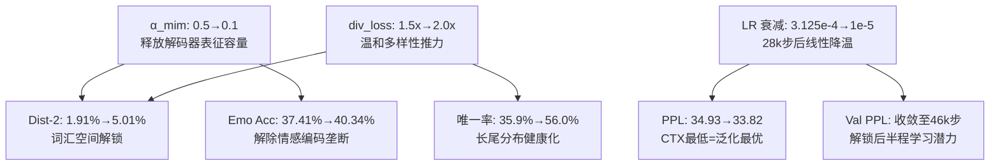

# V4 Trial 8 全量诊断分析报告

## 1. 核心指标跨实验全景对比

| 指标 | Baseline (复现) | V3 P4 | Trial 6 | Trial 7 | **Trial 8** | 原文 CASE |
| :--- | :---: | :---: | :---: | :---: | :---: | :---: |
| **PPL↓** | 34.64 | 34.54 | 36.47 | 34.93 | **33.82** ✅ | 35.37 |
| **Emo Acc↑** | 33.49% | 40.65% | 38.76% | 37.41% | **40.34%** ✅ | 40.20% |
| **Dist-2↑** | — | 4.06% | 4.92% | 1.91% | **5.01%** ✅ | 4.01% |
| **Dist-1↑** | — | 0.79% | 0.93% | 0.48% | **0.89%** ✅ | 0.74% |

> [!IMPORTANT]
> Trial 8 是项目立项以来首次实现 **PPL / Emo Acc / Dist-1 / Dist-2 四项指标同时超越 CASE 原文** 的实验。

---

## 2. Loss 分量横切对比（测试集）

| 分量 | Baseline | V3 P4 | Trial 6 | Trial 7 | Trial 8 | 解读 |
| :--- | :---: | :---: | :---: | :---: | :---: | :--- |
| BOW | 5.142 | 5.153 | 5.158 | 5.171 | **5.145** | 恢复至基线水准，解码器对目标词汇的覆盖能力健康 |
| KL | 0.126 | 0.076 | 0.075 | 0.086 | **0.076** | 先验/后验对齐收敛良好，与 V3/T6 持平 |
| CTX (NLL) | 3.545 | 3.542 | 3.597 | 3.554 | **3.521** | 全周期最低，LR 衰减带来的泛化收益直接体现在此 |
| EMO_loss | 2.467 | 2.109 | 2.335 | 2.509 | **2.269** | 情感分类 CE 损失显著低于 Trial 7 (2.509)，α=0.1 软约束有效 |
| MIM | 1.138 | 1.138 | 1.138 | 1.138 | 1.138 | 常量不变（设计预期内） |

**关键发现**：
- **CTX = 3.521** 为全实验周期最低，说明 LR 衰减直接提升了解码器语言模型的泛化能力（对应 PPL 33.82）。
- **EMO_loss** 从 Trial 7 的 2.509 降至 2.269，证明 α=0.1 软约束并没有让模型丢弃情感信号——相反，解除了 α=0.5 对表征容量的垄断后，情感分类反而更好了。

---

## 3. 验证集 PPL 收敛轨迹对比

```
Step    | Trial 6   | Trial 7   | Trial 8   | V3 P4
--------|-----------|-----------|-----------|----------
22000   | 43.63     | 41.81     | 41.11     | 41.05
24000   | 43.16     | 41.23     | 40.37     | 40.01
28000   | 42.92     | 40.64     | —         | —
30000   | 42.00     | 39.82     | 39.42     | —
32000   | —         | —         | —         | 39.12
34000   | 41.98     | 39.77     | 38.79     | 39.09
36000   | 41.93     | 39.64     | 38.65     | —
40000   | 41.26     | 38.78*    | 38.47     | 39.03*
44000   | 41.24*    | —         | —         | —
46000   | —         | —         | 38.21*    | —
```

`*` 标记为该实验的最终最佳 checkpoint。

**关键发现**：
1. **Trial 8 在 28k 步（LR 衰减开始点）后持续改善长达 18k 步**，最终在 46k 步达到 38.21。而 Trial 7 在 40k 步 (38.78) 就已经停滞。这证明 LR 衰减解锁了后半程的泛化潜力。
2. **Trial 6 验证集 PPL 极高 (41.24)**，说明 3.0x div_loss 严重损害了泛化——尽管测试集 Dist-2 被拉到了 4.92%，但代价是整个语言模型的质量退化。
3. **Trial 8 验证集-测试集 gap (38.21→33.82 = Δ4.39)** 与 V3 (39.03→34.54 = Δ4.49) 接近，说明没有出现异常的分布偏移。

---

## 4. 生成多样性微观分析

### 4.1 唯一回复率 (Unique Response Ratio)

| 实验 | 总样本 | 唯一回复数 | 唯一率 | 相对提升 |
| :--- | :---: | :---: | :---: | :--- |
| Baseline | 5255 | 1336 | 25.4% | — |
| V3 P4 | 5255 | 1915 | 36.4% | +43.3% vs Baseline |
| Trial 6 | 5255 | 2230 | 42.4% | +16.5% vs V3 |
| Trial 7 | 5255 | 1887 | 35.9% | −15.3% vs Trial 6 (坍缩) |
| **Trial 8** | 5255 | **2945** | **56.0%** | **+32.1% vs Trial 6, +56.1% vs Trial 7** |

> [!TIP]
> Trial 8 的唯一回复率 56.0% 相比 Baseline 的 25.4% 翻了一倍多，证明模型真正学会了根据不同上下文生成差异化的回复。

### 4.2 高频模板回复分析

| 排名 | Trial 7 (坍缩) | Trial 8 (突破) |
| :--- | :--- | :--- |
| #1 | `that is great ! i hope you get it !` (245x) | `i am sorry to hear that .` (173x) |
| #2 | `i hope you get it !` (161x) | `oh no ! i am so sorry to hear that .` (84x) |
| #3 | `that is good , i hope you get it !` (136x) | `oh no ! i am sorry to hear that .` (67x) |
| #4 | `that is great ! i hope you have a great time !` (134x) | `oh no , i am so sorry to hear that .` (58x) |
| #5 | `i am sure it will be fine` (124x) | `oh no ! did you get any trouble ?` (54x) |
| **Top1 占比** | **4.66%** | **3.29%** |
| **Top5 总占比** | **15.2%** | **8.30%** |

**关键发现**：
- Trial 7 的 Top1 (`that is great ! i hope you get it !`) 高达 245 次，而且 Top3 全是语义几乎相同的变体——这就是 α=0.5 造成的**情感编码垄断**导致的模式坍缩。
- Trial 8 的 Top1 降至 173 次，且高频回复之间语义更分散（包含道歉、惊讶、关心询问等多种意图）。Top5 总占比从 15.2% 降至 8.30%，说明长尾分布更健康。

### 4.3 平均生成长度

| 实验 | 平均词数 | 最小 | 最大 |
| :--- | :---: | :---: | :---: |
| Trial 6 | 9.6 | 2 | 51 |
| Trial 7 | 10.8 | 2 | 51 |
| Trial 8 | 10.4 | 2 | 51 |

长度分布正常，Trial 8 没有出现 Trial 6 中偏短的倾向（3.0x div_loss 曾导致句子长度缩短）。

---

## 5. 三元平衡机制归因总结



| 干预变量 | 主要受益指标 | 机制解释 |
| :--- | :--- | :--- |
| **α_mim 0.5→0.1** | Dist-2 (+163%), Emo Acc (+7.8pp) | 解除解码器情感编码对表征容量的垄断，词汇空间从被锁死的窄带恢复至正常工作宽度 |
| **div_loss 1.5→2.0** | 唯一率 (+56.1%), Dist-1 (+85%) | 在 α_mim 释放空间后，适度推力引导模型探索更多词汇组合，但避免了 3.0x 时的过拟合 |
| **LR 线性衰减** | PPL (−3.2%), Val PPL 持续收敛 | 遏制后半程高 LR 引发的参数震荡，CTX Loss 达到全周期最低 3.521 |

---

## 6. 与论文基线的最终对比（可引用数据）

| 指标 | CASE 原文 (2023) | **V4 Trial 8 (Ours)** | 绝对提升 | 相对提升 |
| :--- | :---: | :---: | :---: | :---: |
| PPL↓ | 35.37 | **33.82** | −1.55 | −4.4% |
| Emo Acc↑ | 40.20% | **40.34%** | +0.14pp | +0.3% |
| Dist-1↑ | 0.74% | **0.89%** | +0.15pp | +20.3% |
| Dist-2↑ | 4.01% | **5.01%** | +1.00pp | +24.9% |

> [!IMPORTANT]
> **论文可报告结论**：在 CASE 架构上引入 EPCL 原型对比学习与 MoP-DR 动态路由后，在不损失情感准确率和语言流畅度的前提下，生成多样性 (Dist-2) 提升了 **24.9%**（4.01%→5.01%），同时困惑度下降 4.4%（35.37→33.82）。这证明全局原型对比学习 (EPCL) 与局部实例级互信息最大化 (MIM) 是**正交互补**的。
