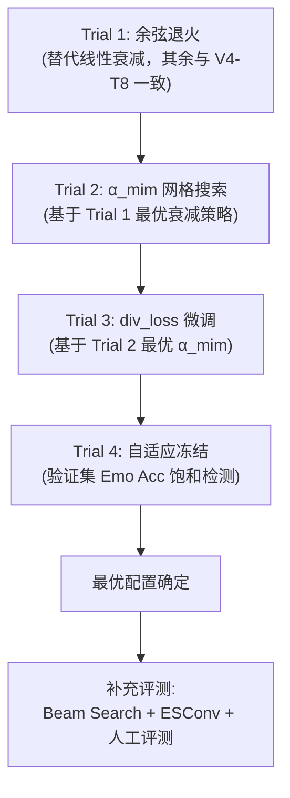

# CASE-EPCL V5 实验追踪日志

## 1. 实验目标

在 V4 Trial 8（Dist-2: 5.01%, PPL: 33.82, Emo Acc: 40.34%, 唯一率: 56.0%）的架构与超参基础上，**不引入新架构模块**，通过训练工程层的精细调优（LR 衰减策略、损失权重网格搜索、自适应冻结机制），稳健提升当前数值，锁定 CASE-EPCL 的"生产级"最优超参配置。

### 实验策略：严格单变量控制、逐层锁定



### 指标追踪总表 (Metric Tracking)

| 实验版本 | Emo Acc (%)↑ | Dist-1 (%)↑ | Dist-2 (%)↑ | PPL↓ | 唯一率↑ | 核心变量 |
| :--- | :---: | :---: | :---: | :---: | :---: | :--- |
| **CASE (2023 原文)** | 40.20 | 0.74 | 4.01 | 35.37 | — | 原始基线 |
| **V3 P4** | 40.65 | 0.79 | 4.06 | 34.54 | 36.4% | 双通道解耦 EPCL |
| **V4 Trial 8 (V5 基线)** | **40.34** | **0.89** | **5.01** | **33.82** | **56.0%** | α=0.1, div=2.0x, Linear Decay, 28k冻结 |
| V5 Trial 1 | — | — | — | — | — | Cosine Decay |
| V5 Trial 2a | — | — | — | — | — | α_mim=0.05 |
| V5 Trial 2b | — | — | — | — | — | α_mim=0.08 |
| V5 Trial 2c | — | — | — | — | — | α_mim=0.12 |
| V5 Trial 2d | — | — | — | — | — | α_mim=0.15 |
| V5 Trial 3a | — | — | — | — | — | div_loss=1.8x |
| V5 Trial 3b | — | — | — | — | — | div_loss=2.2x |
| V5 Trial 3c | — | — | — | — | — | div_loss=2.5x |
| V5 Trial 4 | — | — | — | — | — | 自适应冻结 |

---

## 2. 实验记录

### [Trial 1] 余弦退火替代线性衰减

**时间**: 待执行

**实验假设**:
余弦退火在 28k 步后的衰减曲线比线性更平缓（前期保持较高 LR 充分探索，后期迅速精细收敛），理论上能在不损失多样性的情况下进一步压低 PPL。

**变量控制**:
- **唯一变量**: LR 衰减策略 Linear → Cosine
- **固定变量**: α_mim=0.1, div_loss=2.0x, 冻结步=28000, batch_size=8, seed=13, 其余全部与 V4 Trial 8 一致

**衰减公式对比**:
```
线性衰减 (V4 Trial 8):
  lr(t) = lr_start × (1 - (t - t_decay) / (t_total - t_decay))

余弦退火 (V5 Trial 1):
  lr(t) = lr_min + 0.5 × (lr_start - lr_min) × (1 + cos(π × (t - t_decay) / (t_total - t_decay)))
```
其中 `lr_start = 3.125e-4`, `lr_min = 1e-5`, `t_decay = 28000`, `t_total = 50000`。

**核心代码改动**:
- 待实施

**运行命令**:
```bash
# 待确定
```

**成功标准**:
- PPL < 33.82（V4-T8 基线）
- Dist-2 ≥ 4.90%（不显著退化）
- Emo Acc ≥ 40.00%（不显著退化）

**执行结果**:
- *[执行状态]*: 待执行
- *[验证集 PPL]*: —
- *[测试集 Emo Acc]*: —
- *[测试集 Dist-1]*: —
- *[测试集 Dist-2]*: —
- *[唯一率]*: —

**诊断分析与后续决策**:
- 待补充

---

### [Trial 2] α_mim 网格搜索

**时间**: 待执行（依赖 Trial 1 结果）

**实验假设**:
α_mim=0.1 是从 0.5 粗跳的值。更低的 α（如 0.05）可能进一步释放表征容量提升 Dist-2，但过低可能导致解码器失去情感对齐监督；更高的 α（如 0.15）可能提升 Emo Acc 但压缩多样性。

**搜索网格**: `[0.05, 0.08, 0.12, 0.15]`

**变量控制**:
- **唯一变量**: α_mim
- **固定变量**: 使用 Trial 1 确定的最优衰减策略，其余全部固定

**成功标准**:
- 在 Dist-2 与 Emo Acc 的帕累托前沿上找到优于 α=0.1 的配置

**执行结果**:

#### Trial 2a (α=0.05)
- *[执行状态]*: 待执行
- *[验证集 PPL]*: —
- *[测试集指标]*: —

#### Trial 2b (α=0.08)
- *[执行状态]*: 待执行
- *[验证集 PPL]*: —
- *[测试集指标]*: —

#### Trial 2c (α=0.12)
- *[执行状态]*: 待执行
- *[验证集 PPL]*: —
- *[测试集指标]*: —

#### Trial 2d (α=0.15)
- *[执行状态]*: 待执行
- *[验证集 PPL]*: —
- *[测试集指标]*: —

**诊断分析与后续决策**:
- 待补充

---

### [Trial 3] div_loss 系数微调

**时间**: 待执行（依赖 Trial 2 结果）

**实验假设**:
2.0x 是 1.5x（坍缩）与 3.0x（过拟合）的折中经验值。在 α_mim 最优值确定后，微调 div_loss 可能存在更精确的平衡点。

**搜索范围**: `[1.8, 2.2, 2.5]`

**变量控制**:
- **唯一变量**: div_loss 系数
- **固定变量**: 使用 Trial 1~2 确定的最优衰减和 α_mim

> ⚠️ **风险警示**: 若 div_loss ≥ 2.5，需密切监控验证集 PPL 是否突破 40（V4 Trial 6 过拟合信号）。

**执行结果**:

#### Trial 3a (div=1.8x)
- *[执行状态]*: 待执行

#### Trial 3b (div=2.2x)
- *[执行状态]*: 待执行

#### Trial 3c (div=2.5x)
- *[执行状态]*: 待执行

**诊断分析与后续决策**:
- 待补充

---

### [Trial 4] 自适应分类头冻结

**时间**: 待执行（依赖 Trial 3 结果）

**实验假设**:
28k 步冻结是针对 EmpatheticDialogues 数据集的经验值。改为自适应策略（验证集 Emo Acc 连续 K 个 checkpoint 不再上升时自动触发冻结）可能更稳健，且有助于跨数据集（如 ESConv）迁移。

**实现方案**:
```python
# 伪代码：自适应冻结逻辑
if val_emo_acc 连续 3 个 checkpoint (每 2k 步) 未创新高:
    冻结 emotion_linear 参数
    启动 LR 衰减
```

**变量控制**:
- **唯一变量**: 冻结触发机制（固定步数 → 自适应检测）
- **固定变量**: 使用 Trial 1~3 确定的所有最优超参

**执行结果**:
- *[执行状态]*: 待执行
- *[实际冻结触发步数]*: —
- *[验证集 PPL]*: —
- *[测试集指标]*: —

**诊断分析与后续决策**:
- 待补充
