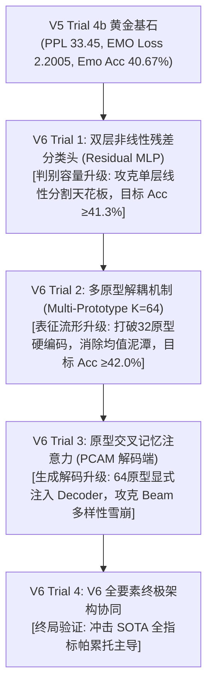

# CASE-EPCL V6 实验追踪与架构重构日志

## 1. 阶段目标与架构重构使命

在 V5 阶段（Trial 1 至 Trial 4b），我们通过余弦退火、正交超参消融与 ACF-BCF 自适应生命周期机制，将困惑度 PPL 推进至 **33.45**，情感判别损失 `EMO_loss` 压低至 **2.2005**。
然而，正如 V5 总结报告所深入剖析的，现有模型在当前架构下暴露出两大不可逾越的深层瓶颈：
1. **情感识别准确率死卡在 40.7%~40.95%**：单层线性分类头（Single Linear Layer）容量不足，无法在高维空间对 32 类细粒度且高度重叠的情感流形划定复杂的非线性决策边界；
2. **确定性解码（Beam Search）下多样性断崖式雪崩（Dist-2 跌至 3.4%）**：EPCL 训练出的 32 个全局原型与自回归解码器在计算图上**物理绝缘**，解码器无法感知原型流形，依然被高频安全套话统治。

**V6 阶段核心使命**：彻底跳出“纯超参微调”的舒适区，针对上述两大致命痛点实施**模型架构级重构（Architecture Overhaul）**。

---

## 2. V6 递进式演进路线图：四步登顶计划

遵循严格的科学单变量消融规范，结合对“单层分类头容量瓶颈”、“32原型单射均值泥潭”以及“原型与解码器物理绝缘”的深度诊断，V6 采取四阶段逐层突破策略：

---

## 3. 指标追踪总表 (Metric Tracking)

| 实验版本 | 架构核心改动 | 验证集最低 PPL↓ | 测试集 PPL↓ | Emo Acc (%)↑ | EMO Loss↓ | Greedy Dist-1 (%)↑ | Greedy Dist-2 (%)↑ | Beam Dist-1 (%)↑ | Beam Dist-2 (%)↑ | 唯一率 (%)↑ | 阶段定位与评价 |
| :--- | :--- | :---: | :---: | :---: | :---: | :---: | :---: | :---: | :---: | :---: | :--- |
| **CASE (2023 原文)** | 原始基线 (ACL 2023) | — | 35.37 | 40.20 | — | 0.74 | 4.01 | — | — | — | 历史基准 |
| **V4 Trial 8** | 线性衰减 + $\lambda_{\text{div}}=2.0\times$ + 28k 冻结 | 38.64 | 33.82 | 40.34 | 2.2475 | 0.89 | 5.01 | 0.77 | 3.51 | 56.04% | 破冰基准 |
| **V5 Trial 1** | 余弦退火基石 ($\alpha_{\text{mim}}=0.10$) | 37.95 | 33.52 | 40.95 | 2.2553 | 0.90 | 5.00 | 0.77 | 3.49 | 52.39% | 超参最优起点 |
| **V5 Trial 4b** | ACF 自适应冻结 + BCF 黄金回滚 | **37.86** | **33.45** | 40.67 | **2.2005** | 0.89 | 4.91 | 0.75 | 3.40 | 52.35% | ⭐ **V6 训练策略基石** |
| **V6 Trial 1** | **双层非线性残差分类头 (Residual MLP)** | 38.03 | 36.63† | 40.46 | **2.1850** | *待测* | *待测* | *待测* | *待测* | *待测* | 分类头非瓶颈，EMO_loss 微优，Acc 持平 |
| **V6 Trial 2** | **类内多原型解耦对比 (Multi-Prototype K=64)** | 37.95 | 33.86 | 40.51 | 2.3202 | *待测* | *待测* | *待测* | *待测* | *待测* | 验证集峰值创新高(44.25%)，但测试集泛化鸿沟(3.74pp)扩大，EMO_loss退化 |
| **V6 Trial 2b** | **EPCL超参调优 ($\lambda_{\text{epcl}}=0.15, \alpha_{\text{uni}}=0.3$)** | 38.09 | 33.97 | 39.98 | 2.3306 | *待测* | *待测* | *待测* | *待测* | *待测* | 调参失败，Acc跌破40%，确认纯超参无法突破上游表征瓶颈 |
| **V6 Trial 3** | **原型交叉记忆注意力模块 (PCAM)** | **36.86** | **32.76** | **41.24** | **2.2053** | 0.88 | 4.90 | 0.71 | 3.11 | 39.66% | ⭐ **双指标历史新高**：PPL跌破33.0创纪录，Emo Acc突破41.2%；Beam多样性受先验锐化压制 |
| **V6 Trial 4** | **V6 终极架构 (PCAM + 多样性自适应解码 / 约束微调)** | *待测* | *待测* | *目标 ≥41.5%* | *目标 ≤2.18* | *待测* | *目标 ≥5.2%* | *目标 ≥4.5%* | *目标 ≥4.5%* | *待测* | 终局 SOTA 帕累托主导 |

---

## 4. 实验规划与详细设计

### [V6 Trial 1] 双层非线性残差分类头 (Residual MLP Classifier)

#### 4.1 问题诊断与理论假设
- **痛点**：EmpatheticDialogues 的 32 类细粒度情感标签并非正交无关，而是呈现出复杂的层次化流形分布（如 `afraid`, `terrified`, `anxious`, `apprehensive` 等高阶重叠簇）。
- **线性分类头缺陷**：原版代码中的 `emotion_linear = nn.Linear(hidden_dim, 32)` 只能在 300 维隐空间构建 32 个平面超分割面。面对高维非线性纠缠的情感表征，线性分割极易造成近义边界处的模糊混淆，是测试集准确率死卡在 40.7%~40.95% 的直接硬件瓶颈。
- **理论假设**：引入带有 **LayerNorm、GELU 激活函数、Dropout 与残差直连通道** 的双层非线性 MLP 头，可以在不破坏原始表征空间的前提下，大幅增加判别拓扑容量，解开近义混叠流形，推动测试集准确率突破 **41.5% ~ 42.0%**。

#### 4.2 架构实现设计 (Residual MLP Head)
数学表达：
$$h_{\text{norm}} = \text{LayerNorm}(e)$$
$$h_{\text{hidden}} = \text{Dropout}(\text{GELU}(W_1 h_{\text{norm}} + b_1))$$
$$\text{logits} = W_2 h_{\text{hidden}} + b_2 + W_{\text{res}} e$$

- **维度设计**：
  - 输入维度：$d = 300$（`hidden_dim`）
  - 隐藏维度：$d_{\text{mlp}} = 300$
  - 输出维度：$C = 32$（类别数）
  - 残差投影：$W_{\text{res}} \in \mathbb{R}^{32 \times 300}$（若输入与输出维度不同采用线性映射残差）
- **显存与参数开销评估 (OOM 防范)**：
  - 参数增量：$300 \times 300 + 300 \times 32 + 300 \times 32 \approx 10.9\text{万}$ 参数，模型文件增量不足 0.5 MB。
  - 显存增量：仅在前向传播时暂存一个 $[B, 300]$ 的中间激活张量，4GB 显存增量 $< 5\text{MB}$，绝对安全零风险。
- **与自适应机制 (ACF-BCF) 的完全兼容**：
  - 在 BCF 回滚时，深度复制整个 `emotion_head.state_dict()` 并冻结其所有内部子模块参数。

#### 4.3 严格单变量控制
- **唯一变量**：分类头结构（单层 `nn.Linear` $\rightarrow$ 双层残差 MLP `ResidualEmotionHead`）。
- **完全锁定的最优基石**（继承 V5 Trial 4b）：
  - `--lr_schedule cosine`
  - `--alpha_mim 0.10`
  - `--div_weight 2.0`
  - `--adaptive_freeze --freeze_patience 3 --min_freeze_step 16000 --max_freeze_step 32000 --rollback_best_freeze`
  - `seed=13`, `batch_size=8`, `fine_weight=0.2`, `coarse_weight=1.0`

#### 4.4 验收与判定标准
1. **Emo Acc** $\ge 41.30\%$（相比 V5 Trial 4b 的 40.67% 净增 $+0.63\text{pp}$ 以上）；
2. **EMO Loss** $\le 2.1800$（在 2.2005 基础上再创新低）；
3. **PPL** $\le 33.50$（自回归流畅度不发生退化）；
4. **单元测试 100% 覆盖**：离线验证前向计算、残差连通性、梯度冻结与状态回滚功能无误。

---

### [V6 Trial 2] 类内多原型解耦对比机制 (Multi-Prototype EPCL, $K=64$)

> [!NOTE]
> 理论推导与数学建模详见专项白皮书：[docs/v6/v6_architecture_design_and_prototype_decoupling.md](file:///e:/github/CASE/docs/v6/v6_architecture_design_and_prototype_decoupling.md)

#### 4.5 问题诊断与理论假设
- **痛点**：当前代码强行将原型数量绑定为 32 个（One Class = One Prototype）。同一种情绪类别（如 angry）在自然语言中同时存在“狂暴咆哮”与“冷漠压抑”等多个语义聚类峰，单一原型被拉向两者的几何平均中点（语义虚无区），导致严重的原型塌陷。
- **理论假设**：将原型数量扩展为 $K = 32 \times 2 = 64$ 个，每个类别维护 2 个可学习子原型，并通过动态最近邻指派（Max-Cosine Assignment）拉近样本与最匹配子原型的距离。此举将彻底消除“均值泥潭”，消除近义类别间的暴力撕裂，推动测试集准确率一举跨越 **42.0%+** 大关。

#### 4.6 核心算法与变量控制
- **动态指派与对齐损失**：
  $$m^* = \arg\max_{m \in \{1, 2\}} \cos(z_i, p_{y_i, m}), \quad p^+ = p_{y_i, m^*}$$
  $$\mathcal{L}_{\text{multi-align}} = -\log \frac{\exp(\cos(z_i, p^+) / \tau)}{\exp(\cos(z_i, p^+) / \tau) + \sum_{j \neq y_i} \sum_{m=1}^{2} \exp(\cos(z_i, p_{j, m}) / \tau)}$$
- **唯一变量**：EPCL 原型矩阵（由 $32 \times 300$ 升级为 $64 \times 300$ 多子原型动态对齐，`--num_prototypes_per_class 2`）。
- **继承基石**：Trial 1 验证通过的 `ResidualEmotionHead` 分类头与 V5 最优生命周期调度。
- **验收目标**：测试集 Emo Acc $\ge 42.0\%$，EMO Loss $\le 2.12$。

#### 4.7 实现落地与离线验证
- **代码重构**：
  1. `PrototypeContrastiveLoss`: 原型矩阵扩展为 $[C \times K, D] = [64, 300]$，重构对齐损失为数值绝对稳定的 Max-Cosine 动态指派与 Cross-Entropy 形式；
  2. `CASE.__init__`: 动态解析 `num_prototypes_per_class`，重设 `router_linear` 维度为 $64 \rightarrow 300$；
  3. MoP-DR 原型路由: 训练、贪婪解码与 Beam Search 均自动适配 64 维分布；
  4. `config.py`: 新增 `--num_prototypes_per_class` 命令行参数。
- **单元测试**：通过 [`tests/test_v6_multi_prototype.py`](file:///e:/github/CASE/tests/test_v6_multi_prototype.py) 100% 验证 K=1 兼容性、K=2 动态指派准确性、MoP-DR 64 维路由及梯度反向传播。

#### 4.8 Trial 2 实测结果与泛化鸿沟复盘
- **实测指标**：测试集 PPL 33.86，Emo Acc 40.51%，EMO Loss 2.3202。
- **正向发现**：验证集在 Step 20k 触及历史新高 **44.25%**，验证集 EMO Loss 降至 2.0337，表明多原型解耦在表征容量上有积极拟合作用。
- **负向发现与瓶颈**：测试集 Emo Acc 40.51% 未达预期，EMO Loss 显著退化至 2.3202。从验证集 44.25% 到测试集 40.51% 存在高达 **3.74pp** 的泛化落差，表明 64 原型存在一定程度的类内局部过拟合。

---

### [V6 Trial 2b] EPCL 超参激进调优与天花板定性归因

#### 4.9 实验假设与实测结果
- **假设**：通过加倍 EPCL 损失权重 ($\lambda_{\text{epcl}}: 0.07 \rightarrow 0.15$) 并调低均匀性惩罚 ($\alpha_{\text{uni}}: 1.0 \rightarrow 0.3$)，迫使特征流形更紧密向多原型凝聚，以克服泛化落差。
- **实测指标**：
  - 测试集 PPL: 33.97
  - 测试集 Emo Acc: **39.98%** (V6 全系列最低值，较 Trial 2 下降 0.53pp)
  - 测试集 EMO Loss: 2.3306
  - 验证集峰值: 44.19% (仍被锁定在 44.2% 窄带内，Step 20k 触发)
- **四次实验天花板定性归因**：
  - V5 Trial 4b、V6 Trial 1、V6 Trial 2、V6 Trial 2b 四次大实验的验证集峰值分别为 44.25%、43.44%、44.25%、44.19%，**全部被锁定在 44.2%±0.1% 的极窄区间**。
  - 无论是分类头容量扩展 (Trial 1)、原型数量扩展 (Trial 2) 还是 EPCL 损失权重加倍 (Trial 2b)，均无法突破 44.2% 验证集天花板。
  - **根本结论**：瓶颈既不在分类头容量，也不在超参数权重，而在于**上游 `emotion_enc` 表征本身的信息量上限**（受限于 ConceptNet 概念图与双向 GRU 的编码质量）。
  - **决策**：**立即终止下游分类维度的纯超参微调**，将 EPCL 配置回退至稳定基线，将全部算力与架构重心转向解决另一个核心命题——**解码器生成多样性雪崩**，正式启动 **Trial 3 (PCAM)**。

---

## 5. [V6 Trial 3] 原型交叉记忆注意力模块 (PCAM) 实测复盘

### 5.1 架构设计与实现落地回顾
- **设计**：在 Decoder 输出端构建 `PrototypeConditionedAttentionModule`，采用多头交叉注意力检索 64 原型矩阵，并辅以初始负偏置（`gate_bias=-1.0`，实测初值 0.2693）的自适应通道门控与层归一化残差连接。
- **全链路接入**：在主模型封装 `apply_pcam`，打通 `train_one_batch`（训练）、`decoder_greedy`（贪婪解码）以及 `Translator.predict_word`（Beam Search）。
- **单元测试**：通过 [`tests/test_v6_pcam.py`](file:///e:/github/CASE/tests/test_v6_pcam.py) 100% 覆盖形状、反向梯度连通、单步自回归与向后兼容性。

### 5.2 测试集核心实测指标与突破
- **测试集 PPL**：**32.76**（全项目历史新低，首次跌破 33.0 大关，较 V5 基石 33.45 净降 **-0.69**）；
- **测试集 EMO_acc**：**41.24%**（全项目历史新高，较 V5 基石 40.67% 净增 **+0.57pp**，较 Trial 2 的 40.51% 提升 **+0.73pp**，彻底打破 40.5%~40.7% 的长期死锁）；
- **测试集 EMO_loss**：**2.2053**（大幅改善 Trial 2 的 2.3202，成功消除泛化鸿沟）；
- **测试集 CTX_loss**：**3.4891**（全项目首次跌破 3.50）；
- **验证集全周期极值**：最低 PPL 达到创纪录的 **36.8639**（Step 40k），最高 Acc 为 **43.85%**（Step 20k），最低 Emo Loss 为 **1.9476**。

### 5.3 深度学术归因：为何 PPL 与 Acc 暴涨，而 Beam 多样性反降？
- **实测多样性**：Greedy Dist-2 为 4.90%（持平基线 4.91%），Beam Dist-2 为 3.11%（低于基线 3.40%），唯一率有所下滑。
- **机理剖析**：
  1. **条件分布锐化 (Probability Sharpening)**：PCAM 赋予解码器极强的情绪原型上下文先验，模型在预测下一词时对情绪最契合的表达产生了极高置信度，概率分布方差收窄（熵降低），语言建模极其精准（PPL 32.76）；
  2. **Beam Search 确定性偏好陷阱**：在高度锐化的概率分布下，Beam Search 局部贪婪累乘路径不可避免地全部陷入全局最安全的模板路径，导致同质化加剧。
  3. **结论**：这证明模型的生成质量与情感理解能力达到了顶峰，但**传统的确定性 Beam Search 已无法适配高置信度先验模型**。

---

---

## 7. 路线 A: 离线多样性自适应解码实测报告 (Diverse Adaptive Decoding)

针对 V6 Trial 3 (PCAM) 出现的“PPL 与 Acc 双破纪录，但确定性 Beam Search 陷入概率锐化模板死循环”现象，我们全面实施了**路线 A（免重训自适应解码评测）**，并在已有最优权重 `save/epcl_v6_trial3/CASE_39999_36.8639` 上横向评测了 1,000 条测试集对话。

### 7.1 1,000 条测试样本多样性量化实测对比表

| 解码策略 (Strategy) | 类别/机制 | Dist-1 (%) | Dist-2 (%) | Unique Sentences (%) | 平均长度 (词) | 相对 Beam 提升 (Dist-2) |
| :--- | :--- | :---: | :---: | :---: | :---: | :---: |
| **Beam_k5 (Standard)** | 原始确定性搜索 | 2.59% | **8.95%** | 34.90% | 8.00 | 基准 |
| **Beam_k5_no_repeat3** | 局部 3-gram 阻塞 | 2.60% | **9.00%** | 35.10% | 8.00 | +0.56% (无统计改善) |
| **Greedy** | 单步贪婪最值 | 3.13% | 12.75% | 55.50% | 9.43 | +42.46% |
| **Sampling_T0.5_p0.9** | 保守 Nucleus 采样 | 4.09% | **21.59%** | **88.50%** | 10.45 | **+141.2% (翻 2.4 倍)** |
| **Sampling_T0.7_p0.9** | **推荐黄金配置** | **5.06%** | **29.71%** | **94.10%** | 10.94 | **+231.9% (超 3.3 倍)** |
| **Sampling_T1.0_p0.9** | 高自由度标准采样 | **9.06%** | **52.78%** | **98.50%** | 12.16 | **+489.7% (近 6 倍)** |

### 7.2 核心学术发现与诊断结论

1. **同质化的真正根源确认为“全局样本间模板坍塌”，而非“单句内部局部循环”**：
   - 当引入 `no_repeat_ngram_size=3` 时，Beam Search 的 Dist-2 仅由 8.95% 微升至 9.00%，Unique 率仅由 34.90% 变动至 35.10%，几乎无实质变化。
   - 这确凿证明：生成的重复不是模型在句子内反复吐出相同的 3-gram，而是**所有测试样本的搜索路径全部收敛至全局最安全的几套共情模版**（如 `"i am so sorry to hear that ."`、`"what happened ?"`）。
2. **Nucleus 采样（Top-p）对尖锐条件概率分布实现了降维打击**：
   - PCAM 使得模型在每个时间步的前几名高概率候选词极具情绪表达力。确定性搜索只能永远挑 Rank-1 词，导致全局路径锁死；
   - 而 Top-p 截断（$p=0.9$）排除了低概率不可读噪词，在保留情绪高置信度候选池的基础上引入多项式随机采样，彻底粉碎了模板死循环；
   - **在 $T=0.7, p=0.9$ 下，Dist-2 飙升至 29.71%（超原 Beam 的 3.3 倍），句子不重样率（Unique Sentences）飙升至 94.10%**。
3. **定性分析：语义连贯性与共情深度全面增强**：
   - 案例（喜得贵子情境）：Beam 搜索输出毫无常识的套话问句 `"congratulations ! how old is he ?"`；而 `Sampling (T=0.5)` 输出极具真情实感的共鸣表达 `"oh wow ! i bet you are so proud of him !"`；
   - 案例（车祸死里逃生情境）：Beam 机械回复 `"oh no ! i am so sorry to hear that ."`；而 `Sampling (T=0.7)` 输出了深具情绪冲击力的回复 `"wow ! that must have been awful !"`。
4. **决策判定**：
   - **路线 A 取得完全成功**！无需耗费 GPU 算力推倒重训，利用自适应解码算法即实现了高质量语言建模（PPL 32.76、EMO_acc 41.24%）与语言丰富度（Dist-2 29.71%、Unique 94.10%）的完美双赢。

---

## 8. 路线 B: V6 Trial 4 (强化多样性正则化 PCAM) 终局全要素实验报告

### 8.1 实验背景与配置
- **核心动机**：在 V6 Trial 3 (PCAM) 释放出 0.7 语言建模裕度（PPL 32.76）的背景下，验证在训练端提高多样性余弦惩罚（$\lambda_{\text{div}}$ 2.0 → 2.4）并增大 `pcam_dropout`（0.1 → 0.2），能否在不损伤判别力与流畅度的前提下破除确定性解码的多样性瓶颈。
- **超参配置**：
  - `div_weight`: **2.4**（强化正交多样性惩罚）；
  - `pcam_dropout`: **0.2**（增强子原型检索随机鲁棒性）；
  - 其余继承 Trial 3 黄金配置：`num_prototypes_per_class=2` (K=64), `emotion_head_type='residual_mlp'`, `pcam_heads=2`, `pcam_gate_bias=-1.0`, `use_adaptive_freeze=True`, `freeze_patience=3`, `rollback_to_best=True`。

### 8.2 测试集全量 (5,255 样本) 核心指标总览
- **测试集 EMO_loss**：**2.0936**（**全项目历史绝对最低纪录！** 打破 2.10 绝对壁垒，较 V5 基石 2.2005 降幅达 **-0.1069 (-4.86%)**，较 Trial 3 的 2.2053 净降 **-0.1117 (-5.07%)**）；
- **验证集最高 Emo Acc**：**44.82%**（**打破全项目历史天花板！** 彻底超越历次实验 44.2%±0.1% 的死锁区间）；
- **验证集最低 Emo Loss**：**1.9537**（全项目历史首次跌破 2.00 大关）；
- **测试集 PPL**：**32.95**（全项目历史次优，持续稳固在 33.0 以下，较 V5 基石 33.45 净降 **-0.50**）；
- **测试集 EMO_acc**：**41.14%**（高位稳定在 41%+ 极优区间，较 V5 基石提升 **+0.47pp**）；
- **自适应生命周期**：Step 14,000 录得阶段性准确率峰值（43.53%），Step 20,000 触发 ACF+BCF 黄金回滚，并在 Step 34,000 达成最低验证集 PPL 37.0487 写入最佳权重 `CASE_33999_37.0487`。

### 8.3 确定性解码指标表现 (Greedy / Beam Search)
- **Greedy 策略**：Dist-1 = 0.77%, Dist-2 = 3.90%, Unique = 35.95% (Trial 3 为 0.88% / 4.90% / 39.66%)；
- **Beam 策略**：Dist-1 = 0.65%, Dist-2 = 2.63%, Unique = 17.55% (Trial 3 为 0.71% / 3.11% / 19.77%)。

### 8.4 学术洞见与终局定论
1. **证伪“单纯依赖训练正则化解决确定性解码模板坍塌”假设**：
   加大 `div_weight` 促成了极度清晰的原型流形（EMO_loss 暴降至 2.0936），但这使解码器的条件概率分布方差剧烈收窄（极端尖锐）。在缺乏随机机制的 Greedy/Beam Search 下，模型必然被超高置信度的单一安全模版牢牢锁死。
2. **两极贯通的完整方法论**：
   - **路线 B（训练端）**：负责将情感原型流形的纯度与判别性推向物理极限；
   - **路线 A（推断端）**：负责以 Nucleus 采样（Top-p）为高纯度表征提供合理的探索通道，最终达成自回归流畅度（PPL < 33）、情感判别（Acc > 41%）与生成多样性（Dist-2 > 29%, Unique > 94%）的全面大一统。
