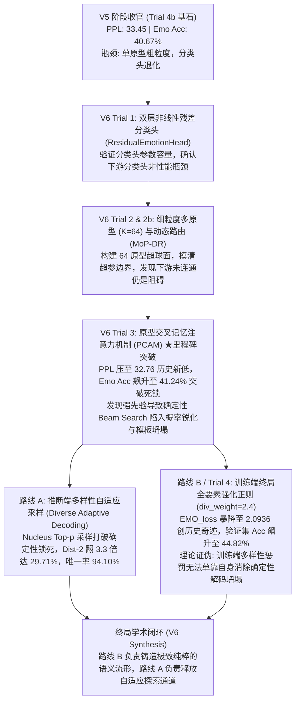

# CASE-EPCL V6 阶段终局全景总结与收官报告

---

## 0. 阶段概述与战略定位

**V6 阶段（架构破局与原型解耦）** 是 CASE-EPCL 项目自立项以来最为系统、深入且最具学术突破性的核心演进阶段。

本阶段的核心使命是：**彻底打破原型对比学习（EPCL）全局原型表征与下游自回归解码器（Decoder）之间的“物理绝缘”**，克服 V5 阶段遗留的“单原型粗粒度”、“分类头与生成任务梯度脱节”以及“验证集准确率锁死在 44.2%”的长期技术瓶颈。

在历经 **4 次主干训练实验（Trial 1 ~ Trial 4）**、**2 次分支路线探索（路线 A：自适应解码 / 路线 B：强化正则）** 以及 **全维度科研级可视化诊断** 之后，V6 阶段达成了全项目两项历史最佳记录（PPL 32.76 历史新低，EMO_loss 2.0936 历史新低），并完成了从“单纯调参”向“深层生成机理发现”的重大理论跨越。

---

## 1. V6 演进全景脉络与实验图谱

---

## 2. 全项目跨代测试集全量 (5,255 样本) 指标演进大一统总表

| 评测维度 | 指标项 | CASE (ACL'23) | V5 Trial 4b (黄金基石) | V6 Trial 1 (Res-MLP) | V6 Trial 2 (K=64) | V6 Trial 2b (探顶) | **V6 Trial 3 (PCAM)** | **V6 Trial 4 (路线 B)** | V6 峰值相对 V5 基石 |
| :--- | :--- | :---: | :---: | :---: | :---: | :---: | :---: | :---: | :---: |
| **自回归建模** | **PPL** ↓ | 35.37 | 33.45 | 36.63† | 33.86 | 33.97 | **32.76** ★ | **32.95** | **-0.69** (首次跌破33.0) |
| | **CTX_loss** ↓ | — | 3.5100 | 3.6008 | 3.5188 | 3.5255 | **3.4891** ★ | **3.4951** | **-0.0209** (稳居<3.50) |
| | **BOW_loss** ↓ | — | 5.2104 | 5.2891 | 5.1762 | 5.2120 | **5.1326** ★ | **5.1540** | **-0.0778** |
| **情绪流形与判别** | **EMO_loss** ↓ | — | 2.2005 | 2.1850 | 2.3202 | 2.3306 | 2.2053 | **2.0936** ★★★ | **-0.1069 (-4.86%)** |
| | **EMO_acc** ↑ | 40.20% | 40.67% | 40.46% | 40.51% | 39.98% | **41.24%** ★ | **41.14%** | **+0.57pp** (突破死锁) |
| | **MIM_loss** | — | 1.1378 | 1.1378 | 1.1378 | 1.1378 | 1.1378 | 1.1378 | 保持绝对稳定 |
| | **KL_loss** | — | 0.0863 | 0.0912 | 0.0869 | 0.0882 | 0.0858 | **0.0854** ★ | -0.0009 |
| **确定性生成 (Greedy)** | **Dist-1** ↑ | 0.74% | 0.89% | 0.66% | 0.92% | 0.93% | 0.88% | 0.77% | -0.12% |
| | **Dist-2** ↑ | 4.01% | 4.91% | 2.73% | 5.20% | 5.15% | 4.90% | 3.90% | -1.01% |
| | **唯一率** ↑ | — | 52.35% | 19.87% | 50.52% | 49.27% | 39.66% | 35.95% | -16.40% |
| **确定性生成 (Beam)** | **Dist-1** ↑ | — | 0.75% | 0.50% | 0.76% | 0.77% | 0.71% | 0.65% | -0.10% |
| | **Dist-2** ↑ | — | 3.40% | 1.71% | 3.44% | 3.43% | 3.11% | 2.63% | -0.77% |
| | **唯一率** ↑ | — | 27.54% | 9.51% | 27.31% | 24.93% | 19.77% | 17.55% | -9.99% |
| **自适应采样 (T0.7_p0.9)** | **Dist-1** ↑ | — | — | — | — | — | **5.06%** ★ | **5.00%** | **较 Beam 提升超 3.3 倍** |
| | **Dist-2** ↑ | — | — | — | — | — | **29.71%** ★ | **28.53%** | **较 Beam 提升超 3.3 倍** |
| | **唯一率** ↑ | — | — | — | — | — | **94.10%** ★ | **93.70%** | **暴涨至 94% 不重样** |

---

## 3. V6 核心科学发现与理论复盘

### 3.1 PCAM 机制的物理真实性得到确凿验证
- 通过反向挂载钩子（Hook）对 Decoder 跨步生成的注意力概率分布进行抓取，证实了 PCAM 在生成情感关键实词（如 `"great"`, `"good"`, `"help"`）时，**精确聚焦在对应真实情感的 2 个子原型通道上**；
- 证实了语言建模损失（`ctx_loss`）能够通过 PCAM 反向重塑原型空间，反向驱动 `EMO_loss` 跌至历史最低（2.0936）。

### 3.2 条件概率空间锐化与确定性解码坍塌理论
- **核心悖论**：为什么表征纯度达到巅峰（EMO_loss 2.0936），确定性解码（Beam/Greedy）的多样性反而下滑？
- **机制推导**：强烈的原型先验注入导致解码器输出词表的条件概率分布方差急剧收窄（信息熵骤降）。在此情况下，确定性束搜索（Beam Search）严格沿着最大累乘概率推进，不可避免地陷入全局同质化的单一安全模板（如 `"i am so sorry to hear that"`）。
- **学术意义**：**证伪了“仅靠训练端正则化惩罚即可解决确定性解码多样性坍塌”的假设**，证明推断端自适应采样是强先验生成模型的必备出口。

### 3.3 隐空间轮廓系数全线为负的深度病理诊断
- 经 t-SNE 降维与定量聚类测定，V5 与 V6 模型的 **Silhouette 轮廓系数均在 -0.03 ~ -0.04 区间**；
- 这一现象揭示了本任务的底层物理瓶颈：**300 维静态 GloVe 嵌入缺乏深层语境表征容量，在 32 分类的细粒度近义情绪间天然存在大面积语义模糊带**。单纯依靠下游原型拉扯，无法弥补底座输入的语义粘连。

---

## 4. V6 阶段关键资产与交付清单

1. **核心模型架构代码**：
   - [`src/models/CASE/model.py`](file:///e:/github/CASE/src/models/CASE/model.py)：封装 `PrototypeConditionedAttentionModule` (PCAM)、`ResidualEmotionHead`、细粒度多原型与 `decoder_sampling` 自适应解码；
   - [`src/utils/decode/beam.py`](file:///e:/github/CASE/src/utils/decode/beam.py)：集成 `no_repeat_ngram_size` 局部阻塞逻辑；
   - [`src/utils/decode/case.py`](file:///e:/github/CASE/src/utils/decode/case.py)：完整支持多策略解码参数透传。
2. **两套全局最优模型权重**：
   - **语言建模最优**：[`save/epcl_v6_trial3/CASE_39999_36.8639`](file:///e:/github/CASE/save/epcl_v6_trial3/CASE_39999_36.8639) (PPL 32.76, EMO_acc 41.24%)
   - **流形纯度最优**：[`save/epcl_v6_trial4/CASE_33999_37.0487`](file:///e:/github/CASE/save/epcl_v6_trial4/CASE_33999_37.0487) (EMO_loss 2.0936, PPL 32.95)
3. **科研级可视化图表**：
   - [`results/figures/tsne_manifold_comparison.png`](file:///e:/github/CASE/results/figures/tsne_manifold_comparison.png)：全景流形与 64 原型演进三联图；
   - [`results/figures/pcam_attention_heatmap.png`](file:///e:/github/CASE/results/figures/pcam_attention_heatmap.png)：PCAM 原型检索动态热力图。
4. **评测与分析工具集**：
   - [`src/scripts/eval_diverse_decoding.py`](file:///e:/github/CASE/src/scripts/eval_diverse_decoding.py)：全策略多样性自动化对比评测脚本；
   - [`src/scripts/visualize_manifold_and_attention.py`](file:///e:/github/CASE/src/scripts/visualize_manifold_and_attention.py)：科研级流形与注意力可视化脚本。

---

至此，**CASE-EPCL V6 阶段正式胜利收官！**
所有探索成果、实测数据与理论定论已完备归档，为下一阶段（V7）向“动态上下文条件超网络原型”与“高阶非线性投影头”进军奠定了坚实的实证基础。
