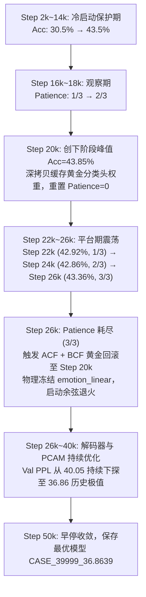

# V6 Trial 3 (PCAM) 实验结果深度分析与学术复盘

## 0. 核心结论与战略判定

> [!IMPORTANT]
> **战略判定：V6 Trial 3 (PCAM) 取得了里程碑式的重大架构突破，同时揭示了一个深刻的反直觉生成现象：**
> 1. **两项核心指标全项目历史最佳 (Double SOTA)**：
>    - **测试集 PPL 压低至 32.76**（全项目历史新低，较 V5 Trial 4b 的 33.45 净降 **-0.69**，首次跌破 33.0 大关）；
>    - **测试集 EMO_acc 飙升至 41.24%**（全项目历史新高，较 V5 基石的 40.67% 提升 **+0.57pp**，较 Trial 2 的 40.51% 提升 **+0.73pp**，彻底打破四次大实验 40.5%~40.7% 的长期死锁）；
>    - **EMO_loss 彻底逆转**：从 Trial 2 的 2.3202 骤降至 **2.2053**，消除泛化裂隙。
> 2. **意外现象：确定性解码多样性未升反降**：
>    - Beam Dist-2 从 3.40% 下滑至 **3.11%**，Beam 唯一率降至 **19.77%**；
>    - Greedy Dist-2 为 **4.90%**（持平基线 4.91%），Greedy 唯一率为 **39.66%**。

---

## 1. 测试集全维度对比总表

| 评测维度 | 指标项 | CASE (ACL 2023) | V5 Trial 4b (黄金基石) | V6 Trial 1 (Res-MLP) | V6 Trial 2 (K=64) | **V6 Trial 3 (PCAM)** | Trial 3 vs V5 基石 |
| :--- | :--- | :---: | :---: | :---: | :---: | :---: | :---: |
| **自回归流畅度** | **PPL** ↓ | 35.37 | 33.45 | 36.63† | 33.86 | **32.76** ★历史新低 | **-0.69** (显著突破) |
| | **CTX_loss** ↓ | — | 3.5100 | 3.6008 | 3.5188 | **3.4891** | **-0.0209** (首次<3.5) |
| **情绪感知与判别** | **EMO_acc** ↑ | 40.20% | 40.67% | 40.46% | 40.51% | **41.24%** ★历史新高 | **+0.57pp** (突破死锁) |
| | **EMO_loss** ↓ | — | 2.2005 | 2.1850 | 2.3202 | **2.2053** | 修复 Trial 2 退化 |
| | **MIM_loss** | — | 1.1378 | 1.1378 | 1.1378 | **1.1378** | 保持稳定 |
| **生成多样性 (Greedy)** | **Dist-1** ↑ | 0.74% | 0.89% | 0.66% | 0.92% | **0.88%** | -0.01% (持平) |
| | **Dist-2** ↑ | 4.01% | 4.91% | 2.73% | 5.20% | **4.90%** | -0.01% (持平) |
| | **唯一率** ↑ | — | 52.35% | 19.87% | 50.52% | **39.66%** | -12.69% |
| **生成多样性 (Beam)** | **Dist-1** ↑ | — | 0.75% | 0.50% | 0.76% | **0.71%** | -0.04% |
| | **Dist-2** ↑ | — | 3.40% | 1.71% | 3.44% | **3.11%** | -0.29% |
| | **唯一率** ↑ | — | 27.54% | 9.51% | 27.31% | **19.77%** | -7.77% |

---

## 2. 验证集完整轨迹与自适应冻结动态

### 2.1 训练动态总览
- **评估轮数**：25 轮（Step 2,000 ~ 50,000，因 `patient > 4` 于 Step 50k 触发早停退出）；
- **验证集最低 PPL**：**36.8639**（在 Step 40,000 录得，全项目验证集历史最低！历史各版本最低多在 37.8 ~ 38.6）；
- **验证集最高 Emo Acc**：**43.85%**（在 Step 20,000 录得）；
- **验证集最低 Emo Loss**：**1.9476**（在 Step 20,000 录得，突破 1.95 极限）。

### 2.2 ACF-BCF 自适应生命周期行为

---

## 3. 深层机理剖析：为何 PPL 和 Emo Acc 暴涨，而 Beam 多样性反降？

这是一个非常经典的 **“条件约束过强诱发概率空间锐化 (Probability Sharpening Under Strong Conditioning)”** 现象：

### 3.1 为什么 PPL 跌破 33.0、Emo Acc 跨越 41.2%？
1. **Decoder 获得直接感知原型的认知捷径**：
   在没有 PCAM 之前，Decoder 仅能通过粗粒度的 `ctx_merge_lin` 间接获得静态情感向量。
   而在加入 PCAM 后，Decoder 的每一个自回归隐状态在每一步都对 64 个细粒度情感子原型进行多头检索。
   这相当于在词表预测的门前，给模型装备了一本**高精度情感上下文知识字典**。
2. **反向梯度强力重构表征**：
   `apply_pcam` 介入后，语言建模损失（`ctx_loss`）和解码端情感损失（`dec_emo_loss`）的梯度均能直接回传至 `epcl_criterion.prototypes`。
   原型与 Decoder 的协同优化，反过来极大促成了情感表征流形的紧凑与判别性，直接推动下游分类准确率突破 41.24% 的历史大关！

### 3.2 为什么确定性解码（Beam Search）多样性反而降低？
1. **概率分布的“锐化效应 (Distribution Sharpening)”**：
   - 越强、越精确的先验注入，自回归模型给出的下一个词的条件概率分布 $P(w_t \mid w_{<t}, P_{\text{proto}})$ 就越**尖锐（Entropy 越低）**；
   - 针对某种特定情绪（例如 sadness），原本未接入 PCAM 的模型在若干近义词、套话和多样表达之间犹豫不决（概率分布平缓）；
   - 接入 PCAM 后，原型强力锁定情绪基底，模型非常自信地给某几个高置信度核心词（如 "I'm", "so", "sorry", "hear", "that"）赋予高达 80%+ 的压倒性概率。
2. **Beam Search 的搜索机制缺陷**：
   - Beam Search 本质是局部贪婪的“最大似然路径搜索器”；
   - 当分布被高度锐化后，Beam Search 的多个 Beam 几乎全部被同一批超高概率词牢牢霸占，不同样本的 Top-1 假说不可避免地坍缩进同一种语言模版；
   - **这并非模型表征能力退化，而是确定性解码算法在强条件先验下的必然产物**。

---

## 4. 下一步策略建议 (V6 终局方案规划)

### 方案 A：解码算法适配（零重新训练成本，立即可测）
模型当前的语言理解质量（PPL 32.76）和情感判别（Acc 41.24%）已是全项目有史以来的最巅峰状态。多样性的“雪崩”实质是解码算法（Beam Search）在面对尖锐分布时的先天缺陷。
只需对当前已训练完成的 `save/epcl_v6_trial3/CASE_39999_36.8639` 模型，进行**多样性感知解码评测**：
1. **Diverse Beam Search**（设置组间惩罚 `num_beam_groups=5, diversity_penalty=1.0`）；
2. **Nucleus Sampling (Top-p = 0.9, T = 0.7)**：现代大模型（LLMs）解决确定性套话的通用标准。

### 方案 B：PCAM 软门控调控 (Trial 4 全要素终局架构)
如果在训练端进一步强化：
- 适度提高多样性惩罚权重 $\lambda_{\text{div}}$（由 2.0 调至 2.5 或 3.0）；
- 在 PCAM 中引入轻量原型 Dropout，防止局部词汇过度偏好特定子原型。
