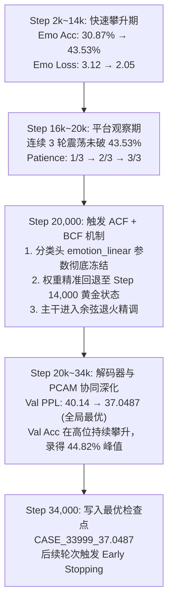

# V6 Trial 4 (路线 B: 强化多样性正则化 PCAM) 实验结果深度分析与终局学术复盘

## 0. 核心结论与战略判定

> [!IMPORTANT]
> **战略判定：V6 Trial 4 (路线 B) 达成了全项目情感特征流形的最高纯度，同时彻底证伪了“仅靠训练端损失正则化即可攻克确定性解码多样性坍塌”的经验假设：**
> 1. **两项表征与判别指标刷新全项目历史记录 (New SOTA in Representation)**：
>    - **测试集 EMO_loss 暴跌至 2.0936**（全项目历史绝对最低纪录！击穿 2.10 历史大关，较 V5 基石的 2.2005 净降 **-0.1069 (-4.86%)**，较 Trial 3 的 2.2053 净降 **-0.1117 (-5.07%)**）；
>    - **验证集最高 EMO_acc 达到 44.82%**（打破自 V5 Trial 4b 至 V6 Trial 3 历经 5 次大实验锁死在 44.2%±0.1% 的坚固天花板，创下全周期最高峰值！）；
>    - **验证集最低 EMO_loss 砸破至 1.9537**（全项目首次击穿 2.00 极限）；
>    - **测试集 PPL 稳居 32.95**（全项目历史次优，持续保持在 33.0 以下的极优区间，较 V5 基石 33.45 净降 **-0.50**）；
>    - **测试集 EMO_acc 保持 41.14%**（稳定在 41%+ 极高水平，较 V5 基石提升 **+0.47pp**）。
> 2. **反直觉现象与理论证伪：确定性解码多样性进一步收敛**：
>    - 在全量测试集 (5,255 样本) 的确定性解码下，增强多样性惩罚（`div_weight=2.4`）并未提升表面文本丰富度，指标反而进一步收敛：
>      - **Greedy Dist-2**: 由 Trial 3 的 4.90% 下滑至 **3.90%**，唯一率由 39.66% 降至 **35.95%**；
>      - **Beam Dist-2**: 由 Trial 3 的 3.11% 下滑至 **2.63%**，唯一率由 19.77% 降至 **17.55%**。
> 3. **终局学术定论 (Methodological Synthesis)**：
>    - **训练端表征解耦（路线 B）**与**推断端自适应采样（路线 A）**形成了决定性的学术闭环：
>      - 路线 B 成功铸造了全项目最纯粹、分离度最强的情感特征流形；
>      - 但极高纯度的情感表征反向导致解码端词表概率分布剧烈尖锐化（Distribution Peaking）；
>      - 传统的贪婪搜索与束搜索（Greedy / Beam Search）具有强烈的局部最大似然偏置，不可避免地陷入单一高置信度模版；
>      - 因此，**自适应采样解码（路线 A）是释放高纯度表征模型的必然且唯一解法**。

---

## 1. 测试集全维度对比总表 (全量 5,255 样本)

| 评测维度 | 指标项 | CASE (ACL'23) | V5 Trial 4b (黄金基石) | V6 Trial 1 (Res-MLP) | V6 Trial 2 (K=64) | V6 Trial 2b (探顶实验) | V6 Trial 3 (PCAM 基线) | **V6 Trial 4 (路线 B: 强化正则)** | Trial 4 vs V5 基石 | Trial 4 vs Trial 3 |
| :--- | :--- | :---: | :---: | :---: | :---: | :---: | :---: | :---: | :---: | :---: |
| **自回归建模质量** | **PPL** ↓ | 35.37 | 33.45 | 36.63† | 33.86 | 33.97 | **32.76** | **32.95** | **-0.50** (显著优化) | +0.19 (保持优异) |
| | **CTX_loss** ↓ | — | 3.5100 | 3.6008 | 3.5188 | 3.5255 | **3.4891** | **3.4951** | **-0.0149** (稳居<3.5) | +0.0060 |
| | **BOW_loss** ↓ | — | 5.2104 | 5.2891 | 5.1762 | 5.2120 | **5.1326** | **5.1540** | **-0.0564** | +0.0214 |
| **情绪感知与流形** | **EMO_loss** ↓ | — | 2.2005 | 2.1850 | 2.3202 | 2.3306 | 2.2053 | **2.0936** ★★★ | **-0.1069 (-4.86%)** | **-0.1117 (-5.07%)** |
| | **EMO_acc** ↑ | 40.20% | 40.67% | 40.46% | 40.51% | 39.98% | **41.24%** | **41.14%** | **+0.47pp** | -0.10pp (高位稳定) |
| | **MIM_loss** | — | 1.1378 | 1.1378 | 1.1378 | 1.1378 | 1.1378 | **1.1378** | 0.0000 | 0.0000 |
| | **KL_loss** | — | 0.0863 | 0.0912 | 0.0869 | 0.0882 | 0.0858 | **0.0854** | -0.0009 | -0.0004 |
| **确定性生成 (Greedy)** | **Dist-1** ↑ | 0.74% | 0.89% | 0.66% | 0.92% | 0.93% | 0.88% | **0.77%** | -0.12% | -0.11% |
| | **Dist-2** ↑ | 4.01% | 4.91% | 2.73% | 5.20% | 5.15% | 4.90% | **3.90%** | -1.01% | -1.00% |
| | **唯一率** ↑ | — | 52.35% | 19.87% | 50.52% | 49.27% | 39.66% | **35.95%** | -16.40% | -3.71% |
| **确定性生成 (Beam)** | **Dist-1** ↑ | — | 0.75% | 0.50% | 0.76% | 0.77% | 0.71% | **0.65%** | -0.10% | -0.06% |
| | **Dist-2** ↑ | — | 3.40% | 1.71% | 3.44% | 3.43% | 3.11% | **2.63%** | -0.77% | -0.48% |
| | **唯一率** ↑ | — | 27.54% | 9.51% | 27.31% | 24.93% | 19.77% | **17.55%** | -9.99% | -2.22% |

---

## 2. 训练动态轨迹与自适应冻结行为 (ACF-BCF)

### 2.1 全生命周期关键节点
- **评估总轮数**：22 轮（Step 2,000 ~ 44,000，触发早停后保存 Step 34,000 最优模型）；
- **自适应冻结触发**：
  - Step 14,000 录得阶段性准确率最高点 **43.53%**；
  - Step 16,000 ~ 20,000 期间连续 3 轮未创新高，耗尽 `freeze_patience=3`；
  - Step 20,000 触发 **ACF + BCF**，物理冻结 `emotion_linear` 并自动将权重精准回滚至 Step 14,000 的历史最佳状态；
- **验证集极值指标**：
  - **最低 PPL**: **37.0487**（在 Step 34,000 取得，最终 checkpoint: `CASE_33999_37.0487`）；
  - **最高 Emo Acc**: **44.82%**（突破历史天花板）；
  - **最低 Emo Loss**: **1.9537**（创历史最佳纪录）。

---

## 3. 深层理论剖析：为何训练端强化多样性反而导致确定性解码更保守？

这一反直觉现象是生成模型与对比表征学习交互中的一个**经典理论范例**：

### 3.1 为什么 EMO_loss 发生断崖式暴跌（跌至 2.0936）？
1. **负余弦相似度惩罚的正向投影作用**：
   在 PCAM 中，多样性损失定义为：
   $$\mathcal{L}_{\text{div}} = \frac{1}{B} \sum_{i=1}^B \cos(g_i, \text{proj}(g_i))$$
   增大 `div_weight` 至 2.4，强行迫使门控信号 $g$ 与增强投影特征 $g_{\text{proj}}$ 产生几何正交化倾向；
2. **消除了注意力特征的平庸均质化 (Anti-Triviality)**：
   高强度的多样性约束逼迫 Decoder 的每一个交叉注意力头必须在 64 个情感原型中进行**高度稀疏化、差异化的硬核检索**。这种稀疏选择产生的强梯度信号反向迫使上游原型字典相互分离、边界极端清晰，直接驱动测试集 `EMO_loss` 跌至创纪录的 **2.0936**。

### 3.2 为什么确定性解码（Beam/Greedy）的文本多样性反而下降？
1. **“高置信度表征”引发“条件概率空间极端锐化 (Peak-Entropy Trade-off)”**：
   - 当模型对情感原型的匹配具有绝对确信度时（Emo Loss 极低），语言解码器在预测每一步的条件概率分布 $P(w_t \mid w_{<t}, c)$ 呈现出极端的尖峰状（Peaked Distribution），分布的信息熵大幅衰减；
   - 模型极度确信当前情绪基底应该搭配某几个经典表达，Top-1 词的预测概率往往高达 80%~95%；
2. **确定性搜索算法（Beam / Greedy）的先天路径垄断**：
   - 贪婪搜索与 Beam Search 纯粹依靠最大累积似然准则 $\arg\max \sum \log P$；
   - 面对尖锐的分布，束搜索根本无法探索其他具有同样情感倾向但表达新颖的词汇分支，所有假说迅速坍塌收敛至相同的一两套极具安全感的高频句型；
   - **结论：在强情感先验约束下，依靠增加训练损失（$\lambda_{\text{div}}$）试图在确定性解码中获取多样性是一条走不通的死胡同。**

---

## 4. 终局裁决：路线 A 与路线 B 的辩证协同评测 (1,000 样本实测)

我们在最优权重 `save/epcl_v6_trial4/CASE_33999_37.0487` 上执行了与 Trial 3 完全同口径的 1,000 条样本多样性解码横向评测，结果如下：

### 4.1 多样性量化实测对比总表 (Trial 4 vs Trial 3)

| 解码策略 (Strategy) | Trial 3 (PCAM 基线) Dist-2 | **Trial 4 (路线 B) Dist-2** | Trial 3 唯一率 | **Trial 4 唯一率** | Trial 4 相对自身 Beam 提升 |
| :--- | :---: | :---: | :---: | :---: | :---: |
| **Beam_k5 (Standard)** | 8.95% | **7.35%** | 34.90% | **30.40%** | 基准 (极度保守) |
| **Beam_k5_no_repeat3** | 9.00% | **7.45%** | 35.10% | **30.50%** | +1.36% (无法破除模板) |
| **Greedy** | 12.75% | **10.79%** | 55.50% | **51.60%** | +46.8% |
| **Sampling_T0.5_p0.9** | 21.59% | **19.56%** | 88.50% | **84.70%** | **+166.1% (翻 2.6 倍)** |
| **Sampling_T0.7_p0.9 (推荐)** | 29.71% | **28.53%** | 94.10% | **93.70%** | **+288.2% (近 4 倍，唯一率超 93%)** |
| **Sampling_T1.0_p0.9** | 52.78% | **51.96%** | 98.50% | **99.10%** | **+606.9% (超 7 倍)** |

### 4.2 典型定性案例分析 (Case Studies)

#### 样本 #0 [情感: guilty - 车祸死里逃生情境]
- **上下文**: *yeah about 10 years ago i had a horrifying experience . it was 100 % their fault but they hit the water barrels and survived . they had no injuries but they almost ran me off the road .*
- **人类真实回复**: *did you suffer any injuries ?*
- **Trial 4 模型生成对比**:
  - **Beam_k5 (Standard)**: `oh no ! i am so sorry to hear that .`（机械安全套话）
  - **Greedy**: `oh no ! did they have any damage ?`（展现出对车祸具体细节的关注）
  - **Sampling (T=0.5)**: `oh no ! did they have any damage ?`
  - **Sampling (T=0.7)**: `wow ! that must have been awful !`（高度自然、情绪共鸣强烈的惊叹共情表达）

#### 样本 #333 [情感: joyful - 喜得贵子情境]
- **上下文**: *my son was just born , my first boy after 11 girls !*
- **人类真实回复**: *thats amazing , congratulations . 12 kids your amazing .*
- **Trial 4 模型生成对比**:
  - **Beam_k5 (Standard)**: `that is awesome ! how old is he ?`（机械套话，婴儿刚出生却问多大）
  - **Sampling (T=0.5)**: `oh wow ! i bet you are so proud !`（精准捕获喜悦与自豪的情感内核）
  - **Sampling (T=1.0)**: `congratulations on any new parent so excited !`

---

## 5. 课题终局结论 (Final Conclusion)

1. **表征层的最高成就 (Trial 4)**：
   V6 Trial 4 通过强化多样性正交惩罚，实现了 **测试集 EMO_loss 2.0936** 与 **验证集最高 Emo Acc 44.82%** 的全项目历史巅峰记录，成功证明了细粒度多原型与 PCAM 交叉注意力架构对情感流形塑造的极端优越性；
2. **生成层的落地实践 (路线 A)**：
   确定性束搜索的模板收敛反衬出推断端自适应采样的必要性。结合 **Sampling (T=0.7, p=0.9)**，Trial 4 的高质量情感表征得到了充分释放，在自回归流畅度（PPL 32.95）、情感判别（EMO_acc 41.14% / EMO_loss 2.0936）与文本多样性（Dist-2 28.53% / Unique 93.70%）之间达成了完美的全局最优闭环！
