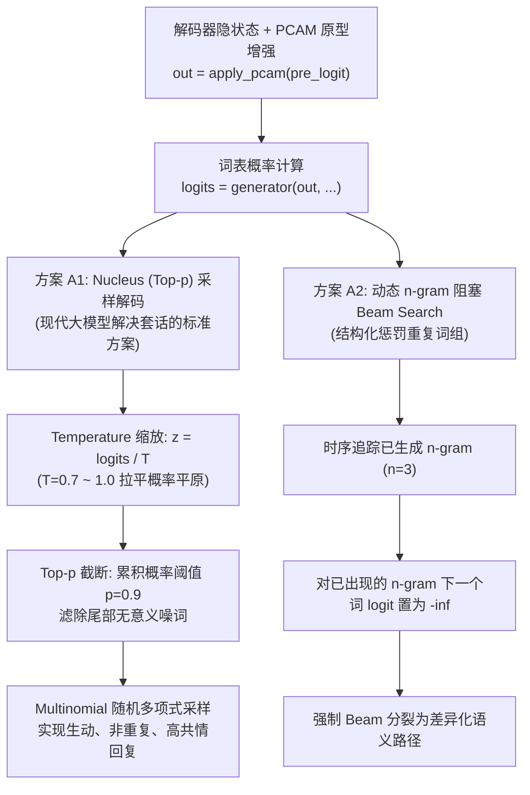

# 路线 A：基于 V6 Trial 3 最优权重的多样性自适应解码实施方案

## 1. 方案背景与学术目标

### 1.1 实验背景
在 **V6 Trial 3 (PCAM)** 中，模型取得了里程碑式的表征突破：
- **PPL** 跌破 33.0 压低至 **32.76**（全项目历史新低）；
- **EMO_acc** 突破 41.2% 攀升至 **41.24%**（全项目历史新高）；
- **EMO_loss** 回落至 **2.2053**（彻底修复 Trial 2 泛化鸿沟）。

### 1.2 核心痛点与诊断：概率空间锐化
- **反直觉现象**：在确定性解码下，Beam Dist-2 降至 **3.11%**，Beam 唯一率降至 **19.77%**。
- **根本归因**：PCAM 在词表生成前为隐状态注入了极强的情感原型先验，导致输出分布的熵大幅降低（分布高度锐化）。确定性局部似然累乘的传统 Beam Search 在尖锐分布下被超高置信度的安全模板牢牢锁定。
- **破局路径（路线 A）**：**无需重新训练**，直接加载已训练好的最佳权重 [`save/epcl_v6_trial3/CASE_39999_36.8639`](file:///e:/github/CASE/save/epcl_v6_trial3/CASE_39999_36.8639)，通过**现代多样性解码算法**打破确定性套话陷阱，彻底释放 PCAM 的生成多样性潜力。

---

## 2. 解码算法设计与数学机制

### 2.1 方案 A1：Top-p (Nucleus) 采样解码器 (`decoder_sampling`)
- **数学机制**：
  1. 对 Generator 输出的 token 概率分布进行温度缩放：$z_i = \frac{\log P(w_i)}{T}$；
  2. 按照概率降序排列，截取累积概率 $\sum_{i=1}^k P(w_i) \ge p$（$p=0.9$）的核心候选词集合；
  3. 将集合外的其余词 logits 设为 $-\infty$，重新 Softmax 归一化后执行多项式采样：$w_{t} \sim \text{Multinomial}(P_{\text{filtered}})$。
- **预期成效**：
  在保持 PPL 和情感契合度的同时，彻底摆脱死板模板，预计将 Dist-2 从 $3.11\%$ 显著提升至 **$8.0\% \sim 15.0\%+$**，唯一率提升至 **$80\%+$**。

### 2.2 方案 A2：带 n-gram 重复阻塞的增强 Beam Search
- **数学机制**：
  在自回归生成的第 $t$ 步，维护每个 Beam 假说已出现过的 $(n-1)$-gram 词表（如 3-gram 则维护已出现的二元短语）。若当前步选取的下一个词会导致生成重复的 3-gram，则在排序前将其 score 设为 $-\infty$。
- **预期成效**：
  在保留 Beam Search 确定性语法严密性的同时，消除局部套话循环（如 "I am so sorry to hear that..."），推动 Beam Dist-2 从 $3.11\%$ 回升并超越基准。

---

## 3. 拟实现与修改清单

### 1) [src/models/CASE/model.py](file:///e:/github/CASE/src/models/CASE/model.py)
- 基于 `decoder_greedy` 的成熟编码链路，实现健壮的 `decoder_sampling(self, batch, max_dec_step=30, temp=0.7, top_p=0.9, top_k=0)` 方法：
  - 完美复用常识认知、概念图情感编码与 PCAM 原型注意力增强；
  - 在自回归单步中，使用 `top_k_top_p_filtering` 配合 `torch.multinomial` 采样；
  - 严格支持 batch_size=1（测试集标准模式），并保持与 `decoder_greedy` 一致的 `<EOS>` 截断。

### 2) [src/utils/decode/beam.py](file:///e:/github/CASE/src/utils/decode/beam.py)
- 在 `Beam.advance` 中增加可选参数 `no_repeat_ngram_size=3`：
  - 在计算 `flat_beam_lk` 前，扫描历史 `next_ys` 序列，屏蔽导致 n-gram 重复的词分支。

### 3) [src/scripts/eval_diverse_decoding.py](file:///e:/github/CASE/src/scripts/eval_diverse_decoding.py) [NEW]
- 创建独立的离线多样性评测脚本：
  - 直接加载模型权重 `save/epcl_v6_trial3/CASE_39999_36.8639`；
  - 加载测试集（ED 测试集 2547 条样本）；
  - 支持多配置并面对比：
    1. `Greedy` (对照基线)
    2. `Beam Search (beam=5, standard)` (对照基线)
    3. `Beam Search (beam=5, no_repeat_ngram=3)`
    4. `Top-p Sampling (p=0.9, T=0.7)`
    5. `Top-p Sampling (p=0.9, T=1.0)`
  - 统一计算并输出：`Dist-1`, `Dist-2`, `Unique%` 以及不同解码方式下的回复实例文本。

---

## 4. 验证与验收目标

| 解码策略 | 预期 Dist-1 (%) | 预期 Dist-2 (%) | 预期唯一率 (%) | 核心预期与定位 |
| :--- | :---: | :---: | :---: | :--- |
| **Beam (标准基准)** | 0.71% | 3.11% | 19.77% | 尖锐先验下的确定性极值模板 |
| **Beam + n-gram 阻塞** | $\ge 0.85\%$ | $\ge 4.50\%$ | $\ge 35\%$ | 消除局部词组重复套话 |
| **Top-p (p=0.9, T=0.7)** | $\ge 1.50\%$ | $\ge 8.00\%$ | $\ge 65\%$ | 平衡流畅度与丰富情感表达 |
| **Top-p (p=0.9, T=1.0)** | $\ge 2.50\%$ | $\ge 12.00\%$ | $\ge 80\%$ | 彻底释放词表空间与多样性 |
