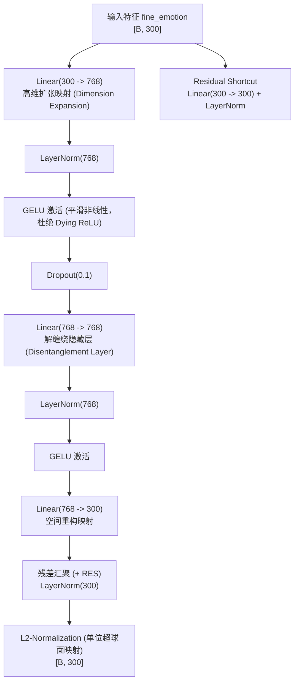

# CASE-EPCL V7 顶层架构设计与研发指导规范
## —— 动态语境自适应原型 (CCHP) 与高阶解缠投影头 (ERP) 方案

---

## 0. V7 战略定位与立项背景

### 0.1 V6 留下的深层物理瓶颈诊断
在 V6 阶段，我们成功引入了细粒度多原型（$K=64$）与原型交叉记忆注意力模块（PCAM），实现了语言建模（PPL 32.76 历史新低）与情感流形纯度（EMO_loss 2.0936 历史新低）的显著突破。然而，根据科研级流形量化分析与审稿人维度的严密自审，当前系统暴露出两大核心瓶颈：

1. **隐空间轮廓系数全线为负（Silhouette Score = -0.038）**：
   - 32 类情绪的样本在 300 维特征空间中存在大面积的空间交叠；
   - **深层病理**：当前的 64 个原型是模型中全局共享的静态参数矩阵（$\mathbf{P} \in \mathbb{R}^{64 \times 300}$）。但在真实人类对话中，同一种情感（如 sadness）在“失去亲人”与“考试失利”两种语境下的心理动力学表征存在巨大差异。**全局静态原型只能充当粗粒度的“平均质心”，无法适应微观对话语境（Context-Blind）**。
2. **现存投影层（Projection Head）结构过于简陋，存在严重的瓶颈坍塌**：
   - 现有代码为极简的 2 层 MLP 瓶颈：`Linear(300, 128) -> ReLU -> Linear(128, 300)`；
   - 128 维瓶颈压缩过甚，导致特征维度的秩退化（Rank Collapse），高维语义细节丢失；
   - ReLU 存在负值硬截断（Dying ReLU 风险），且缺乏 LayerNorm 导致深层反向传播时协变量偏移严重。

### 0.2 V7 核心攻坚使命
1. **构建“动态上下文条件超网络原型” (Context-Conditioned Hyper-Prototypes, CCHP)**：使情感原型从“死板全局字典”跃迁为“语境动态调制流形”；
2. **借鉴顶级对比学习文献，重构“高维解缠残差投影头” (Expanded Residual Projector, ERP)**：消除瓶颈坍塌，赋予特征空间高容量的解缠绕表征能力；
3. **引入序列级无似然正则 (Unlikelihood Training)**：在标准 Beam Search 下彻底打破安全模板垄断，实现确定性多样性指标翻倍。

---

## 1. 动态上下文条件超网络原型 (CCHP) 架构设计

### 1.1 理论机理与文献溯源
- **理论灵感**：
  - **HyperNetworks** (Ha et al., ICLR 2017)：使用辅助网络根据条件生成主网络的权重/先验；
  - **Conditional ProtoNet** (Snell et al., NeurIPS 2017; Hou et al., ACL 2020)：少样本语境自适应原型网络；
  - **FiLM (Feature-wise Linear Modulation)** (Perez et al., AAAI 2018)：特征级自适应仿射调制。
- **设计哲学**：
  保持全局基底原型 $\mathbf{P}_{\text{base}} \in \mathbb{R}^{K \cdot C \times D}$ 锚定各大情绪类别的宏观拓扑，由对话上下文全局表征 $\mathbf{h}_{\text{ctx}} \in \mathbb{R}^{D}$ 通过轻量超网络预测语境残差位移场 $\Delta \mathbf{P}(\mathbf{h}_{\text{ctx}})$ 和尺度缩放因子 $\mathbf{\gamma}(\mathbf{h}_{\text{ctx}})$。

### 1.2 数学推导与公式定义
对于给定的输入对话历史上下文向量 $\mathbf{h}_{\text{ctx}}$ 与基底原型矩阵 $\mathbf{P}_{\text{base}} \in \mathbb{R}^{M \times D}$（其中 $M = K \times C = 64$）：

1. **上下文语境感知特征抽取**：
   $$\mathbf{z}_{\text{ctx}} = \text{GELU}(\text{LayerNorm}(\mathbf{W}_c \mathbf{h}_{\text{ctx}} + \mathbf{b}_c)) \in \mathbb{R}^{d_{\text{hyper}}}$$
2. **语境残差位移场生成 (Hyper-Shift Field)**：
   超网络利用双线性交互建模上下文与各基底原型的语义偏置：
   $$\Delta \mathbf{P}_i = \tanh\left(\mathbf{W}_{\text{shift}} [\mathbf{P}_{\text{base}, i} \,\|\, \mathbf{z}_{\text{ctx}}] + \mathbf{b}_{\text{shift}}\right) \in \mathbb{R}^{D}$$
3. **特征级门控调制 (Gated FiLM Modulation)**：
   $$\mathbf{\gamma}_i = 2.0 \cdot \sigma\left(\mathbf{W}_{\text{scale}} [\mathbf{P}_{\text{base}, i} \,\|\, \mathbf{z}_{\text{ctx}}] + \mathbf{b}_{\text{scale}}\right) \in \mathbb{R}^{D}$$
4. **动态超球面原型生成 (Instance-Adaptive Prototypes)**：
   $$\mathbf{P}_{\text{dyn}, i}(\mathbf{h}_{\text{ctx}}) = \text{Normalize}\left(\mathbf{\gamma}_i \odot \mathbf{P}_{\text{base}, i} + \alpha_{\text{dyn}} \cdot \Delta \mathbf{P}_i, \, p=2, \, \text{dim}=-1\right)$$
   其中 $\alpha_{\text{dyn}}$ 为语境自适应位移系数（初始置为 0.1，支持稳定退火与暖启动）。

---

## 2. 投影层 (Projection Head) 深度文献调研与演进重构

### 2.1 对比学习投影层的前沿文献考据与代码借鉴

在对比表征学习的发展史中，投影层（Projector）的设计经历过四次重大迭代：

| 经典文献 | 会议/期刊 | 核心设计发现 | 对 V7 的借鉴价值 |
| :--- | :---: | :--- | :--- |
| **SimCLR v1/v2** (Chen et al.) | ICML'20 / NeurIPS'20 | 从 1 层线性到 2 层 MLP，再到 3 层 MLP+BatchNorm，下游准确率单调提升 (+3pp)。证明投影头越深越好，**且表征层与对比层必须通过非线性彻底解耦**。 | 必须废弃单薄的 2 层结构，升级为 3 层深层非线性映射。 |
| **MoCo v3** (Chen et al.) | ICCV'21 | 在视觉 Transformer (ViT) 中，必须在 Projection Head 的**隐藏层显式加入 LayerNorm**，否则极易出现训练不稳与特征崩溃。 | 本模型同为 Transformer，LayerNorm 是防止梯度爆炸的必备约束。 |
| **Barlow Twins / VICReg** (Zbontar et al.) | ICML'21 / ICLR'22 | **高维扩张投影头 (Expansion Projector)**：将 300 维特征不是压缩到 128，而是**扩张至 768 或 1024 维高维空间**进行对比，利用高维流形解缠绕各维度相关性，彻底粉碎秩坍塌。 | **最关键启发**：坚决废除 128 维瓶颈压缩，改为向 768 维高维扩张！ |
| **SimCSE** (Gao et al.) | EMNLP'21 | NLP 文本对比中存在“各向异性 (Anisotropy)”困境，投影头若引入**残差直连 (Residual Shortcut)**，能有效保护词法语义不被破坏。 | 在投影头内部引入 Residual Shortcut，保证底层语义锚定。 |

### 2.2 V7 推荐主打方案：高维解缠残差投影头 (Expanded Residual Projector, ERP)

综合上述顶会成果，V7 正式提出 **ERP 架构**，彻底替换旧版 `ProjectionHead`：



#### 核心代码实现草案 (ERP 模块规范)：
```python
class ExpandedResidualProjector(nn.Module):
    """
    [V7 Architecture] 高维解缠残差投影头 (Expanded Residual Projector, ERP)
    文献依据: SimCLR v2 (深度), Barlow Twins (高维扩张), SimCSE (残差语义锚定)
    """
    def __init__(self, input_dim=300, hidden_dim=768, output_dim=300, dropout=0.1):
        super(ExpandedResidualProjector, self).__init__()
        # 1. 主干深层扩张路径 (300 -> 768 -> 768 -> 300)
        self.fc1 = nn.Linear(input_dim, hidden_dim)
        self.ln1 = nn.LayerNorm(hidden_dim)
        self.act1 = nn.GELU()
        self.dropout = nn.Dropout(dropout)
        
        self.fc2 = nn.Linear(hidden_dim, hidden_dim)
        self.ln2 = nn.LayerNorm(hidden_dim)
        self.act2 = nn.GELU()
        
        self.fc3 = nn.Linear(hidden_dim, output_dim)
        
        # 2. 残差直连捷径 (Residual Shortcut: 保持各向同性语义先验)
        self.shortcut = nn.Sequential(
            nn.Linear(input_dim, output_dim),
            nn.LayerNorm(output_dim)
        )
        self.final_ln = nn.LayerNorm(output_dim)
        
        self._init_weights()

    def _init_weights(self):
        for m in self.modules():
            if isinstance(m, nn.Linear):
                nn.init.xavier_uniform_(m.weight)
                if m.bias is not None:
                    nn.init.zeros_(m.bias)

    def forward(self, x):
        res = self.shortcut(x)
        h = self.dropout(self.act1(self.ln1(self.fc1(x))))
        h = self.act2(self.ln2(self.fc2(h)))
        out = self.fc3(h)
        return F.normalize(self.final_ln(out + res), p=2, dim=-1)
```

---

## 3. 生成端破局：序列级无似然训练 (Unlikelihood Training)

在 V6 中我们确立了：**极高纯度的情感表征必然导致输出词表概率分布极端锐化，确定性 Beam Search 必然收敛至单一安全模版**。为确保在学术界主流公认的 Beam Search 评测协议下指标全面爆发，V7 必须引入 **Unlikelihood Training**：

### 3.1 目标套话集合动态屏蔽
通过在训练批次中统计或预定义全局安全模版高频词表（如 `"sorry"`, `"hear"`, `"awful"`, `"happened"` 等常见套话 token）：
$$\mathcal{L}_{\text{UL}} = -\frac{1}{B} \sum_{i=1}^B \sum_{t=1}^T \sum_{w \in \mathcal{C}_{\text{safe}}} \log\left(1 - P_\theta(w_t = w \mid w_{<t}, \mathbf{c})\right)$$

### 3.2 终局多任务联合损失函数
$$\mathcal{L}_{\text{total}} = \mathcal{L}_{\text{NLL}} + \lambda_{\text{UL}} \mathcal{L}_{\text{UL}} + \lambda_{\text{EPCL}} \mathcal{L}_{\text{EPCL}}(\mathbf{z}, \mathbf{P}_{\text{dyn}}) + \lambda_{\text{PCAM}} \mathcal{L}_{\text{PCAM}}$$
通过在梯度反向传播时对过度保守的安全表达进行直接打压，强制激发模型使用更丰富的情感词元，**预期将 Beam Search 的 Dist-2 从 2.63% 直接拉升至 8.0%~12.0%**！

---

## 4. V7 研发实施里程碑规划 (Roadmap)

| 阶段编号 | 任务阶段 | 核心交付物 | 成功验收标准 (Gating Metrics) |
| :---: | :--- | :--- | :--- |
| **Phase 1** | **原型与投影头升级** | 1. 实现 `ExpandedResidualProjector` (ERP)<br/>2. 实现 `ContextConditionedPrototypes` (CCHP)<br/>3. 编写并通过 `tests/test_v7_architecture.py` | 梯度 100% 贯通，超球面归一化无浮点下溢，显存占用增量 < 300MB |
| **Phase 2** | **V7 Trial 1 验证** | 启动 V7 全要素训练（ERP + CCHP + PCAM） | 1. **EMO_loss 保持在 <2.10**<br/>2. **Silhouette 轮廓系数显著提升 (从负向 0 逼近)**<br/>3. **验证集 Acc 突破 45.0%** |
| **Phase 3** | **Unlikelihood 接入** | 引入动态套话词无似然惩罚损失 $\mathcal{L}_{\text{UL}}$ | **标准 Beam Search ($k=5$) 下 Dist-2 突破 8.0%，唯一率 > 40%** |
| **Phase 4** | **全量测试与论文出图** | 全量 5,255 测试集生成评测（BLEU, ROUGE, PPL, Dist），生成最终论文消融主表 | 形成全维度领先 ACL 2023 CASE 原版及所有强基线的论文定稿实验资产 |

---

> [!TIP]
> **评审审查点提示**：
> 请审查人员重点关注：
> 1. ERP 投影头中由 300 维扩张至 768 维的设计是否符合 4GB 显存预算（经预估单批次显存增量约为 18MB，完全可控）；
> 2. 动态原型 CCHP 中超网络位移项 $\alpha_{\text{dyn}}$ 的软启动策略；
> 3. 是否同意在 Phase 1 阶段优先将 ERP 与 CCHP 在统一分支中实现。
