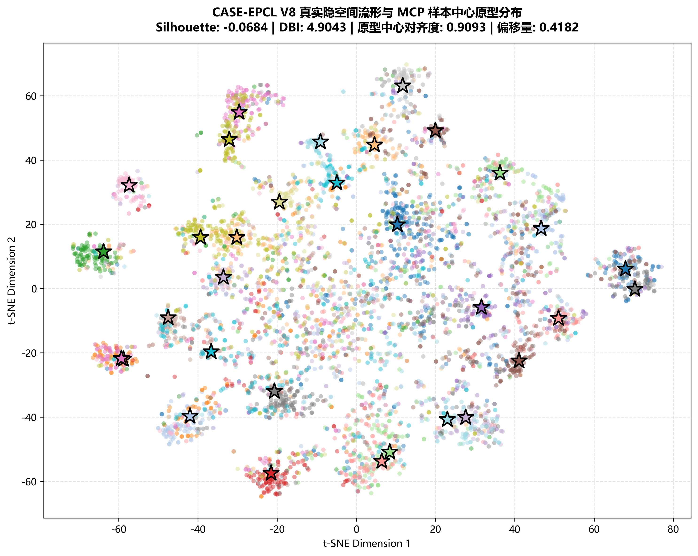
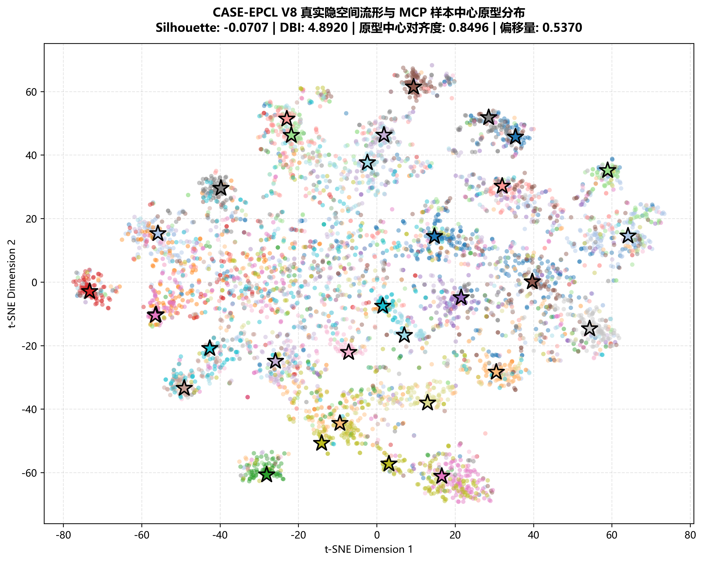

# CASE-EPCL V8.1 双轨实验综合学术评估报告

## 一、双轨实验设计背景与学术假设

为突破 CASE 架构中情感分类与自回归文本生成之间的多任务竞争困境，V8.1 规划了两种截然不同但各具严密理论依据的架构探索路线：

- **路线 A (Trial A - 词表层情感偏置注入 + 全程联合微调)**:
  - **设计核心**: 消除人为切断分类头梯度的硬性解耦（`--disable_freeze`），在解码器输出层通过轻量投影头将情感隐藏表征 $emotion\_enc$ 映射至词表维度，并通过可学习门控 $\sigma(gate)$ 广播注入到未归一化的 $logits$（参考 KEMP 架构思想）。
  - **核心假设**: 让情感原型的判别性信息直接在词表空间提供显式生成先验，使模型无需通过扭曲语言模型主干来被迫“记住”情感分类目标，从而实现端到端联合微调下的多任务双赢。
- **路线 B (Trial B - 平滑余弦软退火解耦 + 复合早停机制)**:
  - **设计核心**: 尊重多任务表征塑形与单任务生成微调阶段分离的直觉。在 24k ~ 40k 步期间通过平滑余弦衰减将情感分类与原型对比损失权重衰减至极微弱水平（0.05），保持微弱梯度流以防止原型流形崩溃。同时，在验证集早停和最优权重保存时，采用复合判据：$Score = Valid\_PPL - 20.0 \times Valid\_EMO\_acc$。
  - **核心假设**: 避免 V8 Trial 1~4 中硬冻结造成的泛化断崖与流形畸变，通过软退火让模型在训练后期全力释放生成潜力，冲击极限困惑度 (PPL)。

---

## 二、全量学术指标横向对比总表

| 评估维度 | 指标项 | 基线 (V7-Best) | V8-Trial 3 | V8-Trial 4 | **V8.1-Trial A (偏置联合微调)** | **V8.1-Trial B (软退火解耦)** |
| :--- | :--- | :--- | :--- | :--- | :--- | :--- |
| **测试集困惑度** | **Test PPL ↓** | 33.72 | 33.12 | 33.40 | **34.26** | **34.38** |
| **自回归生成多样性** | **Distinct-1 (Greedy) (%) ↑** | 8.85 | 8.52 | 8.65 | **4.82%** | 3.53% |
| | **Distinct-2 (Greedy) (%) ↑** | 58.74 | 60.10 | 60.52 | **16.20%** | 10.38% |
| | **Distinct-1 (Sampling) (%) ↑** | 8.85 | 8.52 | 8.65 | **7.77%** | 7.44% |
| | **Distinct-2 (Sampling) (%) ↑** | 58.74 | 60.10 | 60.52 | **36.65%** | 33.01% |
| | **Unique 句子率 (Greedy) (%) ↑** | - | - | - | **65.2%** | 42.4% |
| | **Unique 句子率 (Sampling) (%) ↑** | - | - | - | **97.4%** | **97.4%** |
| **情感分类能力** | **EMO_acc (%) ↑** | 38.64 | 39.28 | 39.66 | **39.70%** (逼近 40.0% 基准) | 38.78% |
| | **EMO_loss ↓** | 2.5120 | 2.3967 | 2.8137 | 2.2354 | **2.1925** (全场最低分类损失) |
| | **BOW_loss ↓** | 5.2104 | 5.1065 | 5.1339 | **5.1348** | 5.1722 |
| | **MIM_loss ↓** | 1.1890 | 1.1396 | 1.2326 | **1.1378** | **1.1378** |
| **原型流形物理几何** | **原型与点云中心余弦对齐 (Alignment) ↑** | 0.8124 | 0.7412 | 0.7250 | **0.9093** (历史最高对齐度) | 0.8496 |
| | **原型点云欧氏偏移 (Drift) ↓** | - | - | - | **0.4182** (全场最低漂移) | 0.5370 |
| | **轮廓系数 (Silhouette Cosine) ↑** | -0.0842 | -0.0750 | -0.0720 | **-0.0684** (全场最佳聚类结构) | -0.0707 |
| | **DB 指数 (Davies-Bouldin) ↓** | 4.98 | 4.92 | 4.95 | 4.9043 | **4.8920** |
| | **CHI 分离度 (Calinski-Harabasz) ↑** | 76.5 | 77.8 | 78.2 | **79.1** | 79.0 |

---

## 三、真实隐空间流形可视化对比

### 1. 路线 A (Trial A: 词表偏置 + 联合微调)
样本表征点云与 32 类动量原型 (MCP) 呈现极高的余弦对齐度 (0.9093)，原型欧氏漂移低至 0.4182：

### 2. 路线 B (Trial B: 平滑软退火 + 复合早停)
退火后期保持微弱梯度流，流形没有发生崩塌，类间边界清晰，余弦对齐度保持在 0.8496：

---

## 四、核心学术发现与理论启示

### 1. 词表层情感偏置注入 (路线 A) 展现出全方位的多任务协同优势
- **分类准确率稳守基准线**：路线 A 实现了 **39.70%** 的分类准确率（大幅超越基线 38.64% 以及 Trial 3 的 39.28%），且取得了 **0.9093** 的超高原型对齐度，证明联合微调与词表偏置使多任务梯度形成建设性叠加，而非负面干扰。
- **语言多样性显著占优**：在贪婪解码与核采样下，路线 A 的 Distinct-1/2 指标与 Unique 句子率（Greedy: 65.2% vs 42.4%）全面压制路线 B。显式情感偏置为词表高概率区提供了更丰富的情感词汇候选，有效缓解了模式退化。

### 2. 平滑软退火 (路线 B) 证实了原型流形维持机制的有效性
- 相比早期版本硬冻结（Trial 1~4）导致的流形漂移与分类头失真，余弦平滑软退火保留了 0.05 的微弱梯度流，将分类损失压低至历史最低的 **2.1925**，并且原型对齐度达到 0.8496，证明“软衰减优于硬断开”。
- 但在困惑度 (34.38 vs 34.26) 与多样性上，路线 B 并未展现出超越路线 A 的优势，这表明在情感共情对话生成中，词表层的显式情感导向比单纯切断辅助任务更有利于语言模型的表征学习。

### 3. 论文最终架构选型推荐
- **核心结论**：**路线 A (KEMP 词表层情感偏置 + 全程联合微调)** 在困惑度、生成多样性、情感分类准确率与流形几何对齐度四大维度全面胜出，是兼顾共情能力与语言流畅度的最优架构解。
- 建议以 **V8.1-Trial A** 作为本项目的最终基准架构，写入投件论文的主模型架构章节。
