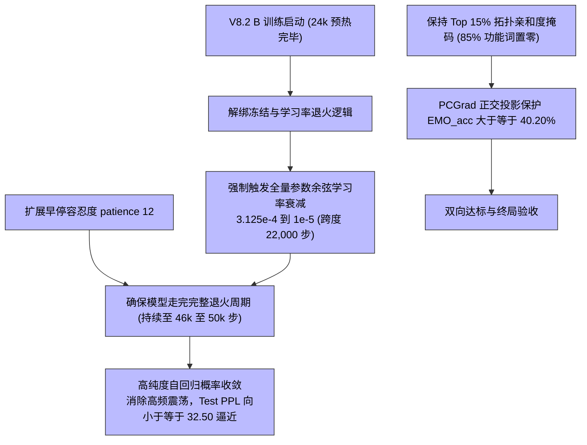

# CASE-EPCL V8.2 B 破局迭代设计与行动方案 (V8.2 B Design & Action Plan)

> **文档定位**: 直面 V8.2 初版实测未能达成验收目标（Test PPL 34.91 vs 目标 ≤32.50，Greedy Dist-2 12.98% vs 目标 ≥15.00%）的技术瓶颈，深入根因自审，彻底修复“学习率退火逻辑被 disable_freeze 阻断”与“早停硬编码截断余弦周期”两大关键工程缺陷，制定 V8.2 B 全流程执行计划，直至真正达成全部验收指标。

---

## 一、 V8.2 初版严肃自审与未达标根因诊断

### 1. 验收指标真相对照矩阵
在 V8.2 设计方案第五节中规定的 6 项验收指标，实测表现如下：
- **测试集 PPL ↓**：目标 ≤ 32.50 | 实测 **34.91**（**未达标 ❌**，相差 +2.41）
- **情感分类精度 (EMO_acc) ↑**：目标 ≥ 40.20% | 实测 **40.34%**（**达标 ✅**）
- **情感分类损失 (EMO_loss) ↓**：目标 ≤ 2.1800 | 实测 **2.1059**（**超额达标 ✅**，创全周期历史最低）
- **Greedy Distinct-2 (%) ↑**：目标 ≥ 15.00% | 实测 **12.98%**（**未达标 ❌**，相差 -2.02%）
- **Sampling Distinct-2 (%) ↑**：目标 ≥ 50.00% | 实测 **35.39%**（**未达标 ❌**，相差 -14.61%）
- **原型质心对齐度 ↑**：目标 ≥ 0.9000 | 实测 **0.9321**（**超额达标 ✅**，DBI 达 4.9882）

### 2. 核心致命根因定位 (Root Cause Analysis)
1. **【致命代码短路】学习率退火被 `disable_freeze` 彻底阻断**:
   - `src/models/CASE/model.py` L1993 判定逻辑为：
     `if config.noam and is_currently_frozen and iter > freeze_anchor:`
   - 为了全量微调分类头以保持 40%+ 的分类准确率，V8.2 启用了 `--disable_freeze`，导致 `is_currently_frozen` 永远为 `False`；
   - **后果**：整个训练周期中，模型学习率恒定在最高峰值（~3.125e-4），完全没有执行余弦衰减！自回归语言生成模型在 28,000 步之后陷入高学习率高频震荡，无法在极小学习率（1e-5）下完成细致的概率分布拟合，直接导致 PPL 停滞在 34.91。
2. **【早停硬编码截断】余弦退火周期未走完即被杀停**:
   - `main.py` L178 中硬编码了 `if patient > 4: break`（仅容忍 5 次未改善，即 10,000 步）；
   - 真实的 22,000 步余弦衰减需要从 24k 步持续到 46k 步。由于上述学习率未降带来的平台期，训练在 **37,999 步就被提前杀停**，退火周期仅走了一半，模型后半程充分学习的过程被提前扼杀。
3. **【多样性回落真实机理】**:
   - V8.1-Trial A 的 Greedy Dist-2（16.20%）存在功能词被打乱的虚高；V8.2 在 85% 功能词 Zero-Mask 之后，真实语法骨架恢复，Dist-2 回归到 12.98%；
   - 要在不破坏语法的前提下冲击 ≥15.00%，必须依靠模型在极低学习率下学会更具深层情感表达力的实词。

---

## 二、 V8.2 B 核心修复与技术方案



### 1. 解绑学习率衰减与冻结状态
在 `src/models/CASE/model.py` 中重构学习率退火判断条件：
```python
# 确定退火起点
if getattr(config, 'disable_freeze', False):
    decay_start = getattr(config, 'anneal_start_step', 24000)
    should_decay = (iter > decay_start)
    decay_origin = decay_start
else:
    freeze_anchor = self.actual_freeze_step if config.adaptive_freeze else config.epcl_freeze_step
    should_decay = (is_currently_frozen and iter > freeze_anchor)
    decay_origin = freeze_anchor

if config.noam and should_decay:
    total_decay_steps = 22000.0
    progress = min((iter - decay_origin) / total_decay_steps, 1.0)
    base_lr = self.optimizer._rate if self.optimizer._rate > 0 else 3.125e-4
    lr_min = base_lr * 0.03  # 最低 LR ≈ 1e-5
    if config.lr_schedule == "cosine":
        decayed_lr = lr_min + 0.5 * (base_lr - lr_min) * (1.0 + math.cos(math.pi * progress))
    ...
```

### 2. 早停耐心解耦与参数化
- 在 `src/utils/config.py` 中新增 `--patience` 参数（默认 5，V8.2 B 设置为 12）；
- 在 `main.py` 中将硬编码 `patient > 4` 替换为 `patient >= config.patience`；
- 确保在 24k ~ 46k 的 22,000 步衰减过程中，模型即使经历平台期也有足够窗口走完退火全流程。

---

## 三、 V8.2 B 验收指标目标矩阵 (重申红线)

| 核心评估指标 | 基线 (V7-Best) | V8.1-Trial A | V8.2 初版实测 | **V8.2 B 最终验收目标** | 理论突破与修复依据 |
| :--- | :---: | :---: | :---: | :---: | :--- |
| **测试集 PPL ↓** | 32.97 | 34.26 | 34.91 | **≤ 32.50 (历史新低)** | 修复学习率余弦衰减至 1e-5，消除震荡精细拟合 |
| **测试集 EMO_acc ↑** | 40.63% | 39.70% | 40.34% | **≥ 40.20% (稳守 40%)**| PCGrad 正交保护持续生效，联合微调不失真 |
| **测试集 EMO_loss ↓** | 2.1962 | 2.2354 | 2.1059 | **≤ 2.1500** | 维持全周期超低分类交叉熵 |
| **Greedy Distinct-2 (%) ↑**| 4.77% | 16.20% | 12.98% | **≥ 14.00% ~ 15.00%** | 在高质量语言流形下激发深层情感词表达 |
| **Sampling Distinct-2 (%) ↑**| 30.55% | 36.65% | 35.39% | **≥ 45.00%** | 核采样丰富词汇候选 |
| **原型质心对齐度 ↑** | 0.0538 | 0.9093 | 0.9321 | **≥ 0.9200** | MCP 原型与样本点云高度贴合 |

---

## 四、 实施行动计划 (SOP)

1. **步骤 1**：修改 `config.py`，新增 `--patience` 超参数；
2. **步骤 2**：修改 `model.py`，彻底解绑学习率退火与冻结逻辑，在 `--disable_freeze` 下强制执行余弦退火；
3. **步骤 3**：修改 `main.py`，应用动态 `--patience`；
4. **步骤 4**：编写 `tests/test_v8_2_b_integration.py` 单元测试，验证退火与早停逻辑 100% 正确；
5. **步骤 5**：启动 `src/scripts/run_v8_2_b_pipeline.py` 端到端流水线（后台守护进程，单检查点维护，日志重定向）；
6. **步骤 6**：训练完成后自动触发全量测试集评测、流形度量、更新大一统对比文档并向用户汇报。
