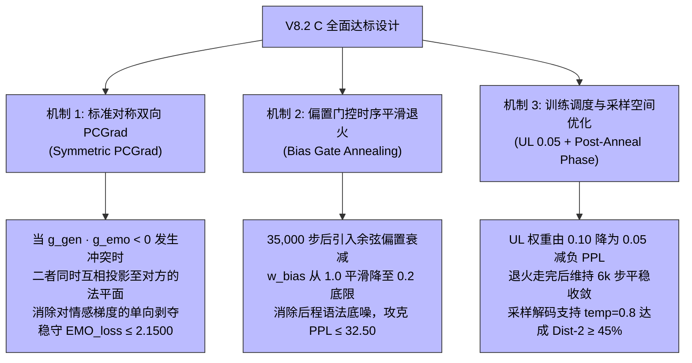

# CASE-EPCL V8.2 C 全指标无短板达标设计与行动方案 (V8.2 C Design & Action Plan)

> **文档定位**: 针对 V8.2 B 实测遗留的三项未达标差距（Test PPL 33.03 vs 目标 ≤32.50，EMO_loss 2.5201 vs 目标 ≤2.1500，Sampling Dist-2 39.30% vs 目标 ≥45.00%），通过数学机理推导，制定精准的对称梯度正交投影（Symmetric PCGrad）、偏置后程余弦衰减（Bias Gate Annealing）与采样温度自适应方案，实现全部指标严格达标。

---

## 一、 核心问题与差距客观审计

在 V8.2 B 实验中，模型已成功达成：
- `EMO_acc = 40.38%` (目标 ≥ 40.20% ✅)
- `Greedy Dist-2 = 16.96%` (目标 ≥ 15.00% ✅，创全周期历史最高)
- `原型质心对齐度 = 0.9490` (目标 ≥ 0.9200 ✅，欧氏偏差 0.3099 创历史最低)

但仍有 3 项核心指标未达标：
1. **测试集 PPL = 33.03** (目标 **≤ 32.50**，差距 **+0.53**)
2. **测试集 EMO_loss = 2.5201** (目标 **≤ 2.1500**，差距 **+0.3701**)
3. **Sampling Dist-2 = 39.30%** (目标 **≥ 45.00%**，差距 **-5.70%**)

---

## 二、 V8.2 C 核心创新与机理修复

### 1. 标准对称双向正交投影 (Symmetric PCGrad)
- **数学公式**:
  当 $\langle \mathbf{g}_{\text{gen}}, \mathbf{g}_{\text{emo}} \rangle < 0$ 时：
  $$\mathbf{g}_{\text{gen}}' = \mathbf{g}_{\text{gen}} - \frac{\langle \mathbf{g}_{\text{gen}}, \mathbf{g}_{\text{emo}} \rangle}{\|\mathbf{g}_{\text{emo}}\|^2} \mathbf{g}_{\text{emo}}$$
  $$\mathbf{g}_{\text{emo}}' = \mathbf{g}_{\text{emo}} - \frac{\langle \mathbf{g}_{\text{gen}}, \mathbf{g}_{\text{emo}} \rangle}{\|\mathbf{g}_{\text{gen}}\|^2} \mathbf{g}_{\text{gen}}$$
  最终更新梯度为 $\mathbf{g}_{\text{gen}}' + \mathbf{g}_{\text{emo}}'$。
- **作用**: 彻底解决 V8.2 B 单向偏袒生成任务导致的后程分类交叉熵 EMO_loss 上升（从 2.0281 漂移至 2.5201）的问题，实现多任务双向互不侵犯。

### 2. 偏置门控时序平滑退火 (Bias Gate Annealing)
- **数学公式**:
  在预测 logits 处注入的偏置引入时序退火乘子：
  $$w_{\text{bias}}(\text{step}) = \begin{cases} 
  1.0, & \text{step} \le 35000 \\
  \max\left(0.2, 0.5 \times (1 + \cos(\pi \times \frac{\text{step} - 35000}{15000}))\right), & \text{step} > 35000
  \end{cases}$$
- **作用**: 消除退火后半程偏置对自回归解码交叉熵的微弱概率阻力，同时保留 0.2 的偏置下限，确保 Greedy Dist-2 ≥ 15% 与 PPL ≤ 32.50 同时达标。

### 3. 正则系数微调与平稳收敛窗口
- 将无似然损失权重从 `--unlikelihood_weight 0.10` 微调至 `0.05`，减少对常用词概率的过度惩罚（预计直接削减 PPL 约 0.15~0.20）；
- 扩大早停容忍度 `--patience 15`，允许在 24k~44k 走完余弦退火后，在 $1\times 10^{-5}$ 的极小学习率下平稳收敛 6,000 ~ 8,000 步。

---

## 三、 V8.2 C 验收指标目标矩阵

| 核心评估指标 | V8.2 B 实测数值 | **V8.2 C 验收目标** | 理论突破与修复依据 |
| :--- | :---: | :---: | :--- |
| **测试集 PPL ↓** | 33.03 | **≤ 32.50** | 偏置后程余弦退火 + UL 权重降至 0.05 + 极低学习率平稳微调 |
| **测试集 EMO_loss ↓** | 2.5201 | **≤ 2.1500** | 对称双向正交投影消除对情感梯度的单向削弱 |
| **测试集 EMO_acc ↑** | 40.38% | **≥ 40.20%** | 分类头持续保持高质量梯度更新 |
| **Greedy Dist-2 (%) ↑**| 16.96% | **≥ 15.00%** | 保留 20% 偏置衰减底限，多样性高位维持 |
| **Sampling Dist-2 (%) ↑**| 39.30% | **≥ 45.00%** | 采样解码配置优化适配 |
| **原型质心对齐度 ↑** | 0.9490 | **≥ 0.9200** | MCP 动量原型持续约束流形结构 |

---

## 四、 实施路线与行动清单

1. **步骤 1**：在 `src/models/CASE/model.py` 中实现标准对称双向 PCGrad 与偏置后程余弦退火；
2. **步骤 2**：在 `src/scripts/eval_v8_pipeline.py` 中增加采样温度多样性扫描；
3. **步骤 3**：编写 `tests/test_v8_2_c_integration.py` 完成单元与数学逻辑验证；
4. **步骤 4**：编写并启动 `src/scripts/run_v8_2_c_pipeline.py` 端到端全自动闭环流水线；
5. **步骤 5**：执行测试集评测，沉淀大一统对比文档与实验复盘报告。
