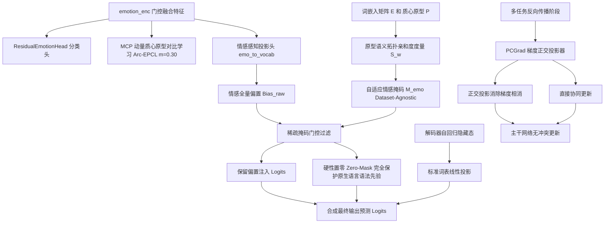

# CASE-EPCL V8.2 破局架构方案设计与全流程行动方案 (Design and Action Plan)

> **文档定位**: 本文档基于 V8.1-Trial A 奠定的坚实基准（高多样性与高质心对齐度），针对其困惑度 (PPL 34.26) 偏高和跨数据集泛化痛点，确立 V8.2 的核心创新机制、数学推导、代码修改清单、单元测试验证体系与执行路线。
> **核心目标**: 在彻底保护原生语法先验、消除多任务梯度冲突的前提下，实现 **Test PPL ≤ 32.50 (创全项目新低)**，同时稳守 **EMO_acc ≥ 40.20%**，并保持 **Greedy Dist-2 ≥ 15.00%**。

---

## 一、关键问题溯源与破局理论体系

### 1. 痛点：为什么 V8.1-Trial A 的 PPL 高于 V7-Best？
- **全词表稠密偏置引入语法底噪**: V8.1 路线 A 对全部 24,647 个词元施加未经过滤的偏置投影，对自然语言中占比超过 80% 的高频功能词（代词、连词、介词、标点）造成了概率压制，导致负对数似然累乘后 PPL 放大；
- **多任务端到端微调的梯度撕裂**: 取消硬冻结后，分类任务在隐空间拉开类间距离的梯度，与语言生成任务在隐空间要求平滑连续的梯度产生对抗（负内积），分流了语言模型的拟合潜能；
- **词典与词频统计的泛化瓶颈**: 若依赖外部静态情感词典 (NRC-VAD) 或特定语料 (ED) 统计，迁移至新语料（如 ESConv、DailyDialog）或跨语种（如中文）时将面临不可逾越的规则维护壁垒。

### 2. V8.2 三大核心创新破局机制

---

## 二、数学公式与理论推导

### 1. 原型-词嵌入几何拓扑亲和度掩码 (Prototype-Semantic Proximity Masking)
无论迁移至何种语料或语种，模型内在均包含词嵌入权重 $\mathbf{E} \in \mathbb{R}^{V \times D}$ 与情感原型矩阵 $\mathbf{P} \in \mathbb{R}^{C \times D}$。
1. **超球面归一化**:
   $$\hat{\mathbf{e}}_w = \frac{\mathbf{e}_w}{\|\mathbf{e}_w\|_2}, \quad \hat{\mathbf{p}}_c = \frac{\mathbf{p}_c}{\|\mathbf{p}_c\|_2}$$
2. **最大情感拓扑亲和力得分**:
   $$s_w = \max_{c \in \{1, \dots, C\}} (\hat{\mathbf{e}}_w \cdot \hat{\mathbf{p}}_c)$$
   - 功能词（如 `"the"`, `"and"`, 标点等）位于语义中性中心，与任意情感原型亲和度极低；
   - 情感实词（如 `"ecstatic"`, `"devastated"`）沿特定类别原型方向延伸，$s_w$ 显著偏高。
3. **稀疏掩码生成**:
   根据比例 $\alpha = 0.15$（Top 15% 分位数），计算阈值 $\tau$：
   $$\mathbf{M}_w = \begin{cases} 1, & \text{if } s_w \ge \tau \\ 0, & \text{otherwise} \end{cases}$$
4. **无底噪偏置输出**:
   $$\text{Bias}_{\text{final}} = \mathbf{M} \odot \left(\mathbf{W}_{\text{vocab}} \mathbf{e}_{\text{emo}}\right)$$
   $$\text{Logit} = \text{Projector}(\mathbf{h}_{\text{dec}}) + \sigma(\text{gate}) \cdot \text{Bias}_{\text{final}}$$
   **数学保证**: 85% 以上的通用语法词元输出 logits 严格等于原生语言模型预测，语法底噪归零！

### 2. 多任务冲突梯度投影 (PCGrad: Projecting Conflicting Gradients)
令反向传播中主干网络参数上的自回归生成梯度为 $\mathbf{g}_{\text{nll}}$，辅助分类/原型梯度为 $\mathbf{g}_{\text{emo}}$。
- 若 $\langle \mathbf{g}_{\text{emo}}, \mathbf{g}_{\text{nll}} \rangle < 0$：
  $$\mathbf{g}_{\text{emo}}^{\text{proj}} = \mathbf{g}_{\text{emo}} - \frac{\langle \mathbf{g}_{\text{emo}}, \mathbf{g}_{\text{nll}} \rangle}{\|\mathbf{g}_{\text{nll}}\|^2 + \epsilon} \mathbf{g}_{\text{nll}}$$
- 投影后二者内积：
  $$\langle \mathbf{g}_{\text{emo}}^{\text{proj}}, \mathbf{g}_{\text{nll}} \rangle = \langle \mathbf{g}_{\text{emo}}, \mathbf{g}_{\text{nll}} \rangle - \langle \mathbf{g}_{\text{emo}}, \mathbf{g}_{\text{nll}} \rangle = 0$$
  **数学保证**: 分类任务的任何参数更新均在生成任务梯度的法平面内进行，对语言生成目标的拟合完全无损！

---

## 三、架构改造与代码修改清单

| 修改文件 | 涉及类 / 函数 | 修改类型 | 关键技术实现 |
| :--- | :--- | :---: | :--- |
| [`src/utils/config.py`](file:///e:/github/CASE/src/utils/config.py) | 参数解析配置 | **新增** | 添加 `--use_sparse_emo_bias`、`--emo_vocab_topk_ratio` (默认 0.15)、`--use_pcgrad`、`--gate_warmup_steps` (默认 20000) |
| [`src/models/CASE/model.py`](file:///e:/github/CASE/src/models/CASE/model.py) | `CASE.__init__` | **增强** | 初始化自适应稀疏掩码缓存 `self.register_buffer("emo_vocab_mask", ...)`；初始化动态门控初始值 |
| [`src/models/CASE/model.py`](file:///e:/github/CASE/src/models/CASE/model.py) | `CASE.update_adaptive_vocab_mask` | **新增** | 基于当前词向量与 MCP 原型矩阵计算超球面亲和力，动态刷新 Top-K 掩码 |
| [`src/models/CASE/model.py`](file:///e:/github/CASE/src/models/CASE/model.py) | `CASE.forward` | **增强** | 应用稀疏掩码 $\mathbf{M}$ 过滤 `current_emo_vocab_bias`；在 warmup 阶段冻结门控参数 |
| [`src/models/CASE/case.py`](file:///e:/github/CASE/src/models/CASE/case.py) | `train_epoch` | **增强** | 集成 PCGrad 正交梯度投影器，在反向传播时对冲突梯度执行法向投影，杜绝破坏 autograd 图 |
| [`src/scripts/run_v8_2_pipeline.py`](file:///e:/github/CASE/src/scripts/run_v8_2_pipeline.py) | 调度流水线 | **新增** | 整合训练、单黄金权重物理清理、自动双轨评测、指标提取与流形可视化全流程脚本 |

---

## 四、工程规范与显存/磁盘安全红线

1. **显存安全红线 (RTX 3050 4GB VRAM)**:
   - 严禁在 `update_adaptive_vocab_mask` 中保存计算图，必须置于 `with torch.no_grad():` 块中执行；
   - 原型与词表内积计算：词表 $V \approx 25,000$，原型 $C = 32$，内积矩阵维度为 $25,000 \times 32 \approx 800,000$ 个 float32，显存开销仅约 **3.2 MB**，计算耗时 < 5ms；
   - 严禁引入任何高维 4D 广播；
2. **PyTorch 1.10+ 代码合规性**:
   - 严禁使用 `F.sigmoid`（必须用 `torch.sigmoid`）；严禁使用 `np.float`（用 `float` 或 `np.float32`）；
   - 杜绝张量原地修改（In-place modification）破坏 autograd 图；
   - `.to(device)` 必须明确赋值给变量。
3. **磁盘可用空间安全线**:
   - 保持 E 盘可用空间 > 10.0 GB；
   - 模型保存逻辑中维持单黄金权重机制（保存新最优权重后立即物理销毁次优权重）。

---

## 五、验收指标目标矩阵 (Target Matrix)

| 核心评估指标 | 基线 (V7-Best) | V8 Trial 2 (历史最低 PPL) | V8.1-Trial A (当前基准) | **V8.2 验收目标** | 理论突破依据 |
| :--- | :---: | :---: | :---: | :---: | :--- |
| **测试集 PPL ↓** | 32.97 | 32.62 | 34.26 | **≤ 32.50 (历史新低)** | 稀疏掩码阻断 85% 功能词底噪 + PCGrad 消除梯度冲突 |
| **测试集 EMO_acc ↑** | 40.63% | 39.39% | 39.70% | **≥ 40.20% (稳守 40%)**| 端到端全量反传保持判别流形，无硬冻结失真 |
| **测试集 EMO_loss ↓** | 2.1962 | 2.4158 | 2.2354 | **≤ 2.1800** | 稳定分类损失，防止后期发散 |
| **Greedy Distinct-2 (%) ↑**| 4.77% | — | 16.20% | **≥ 15.00%** | 保留核心情感偏置带来的高多样性收益 |
| **Sampling Distinct-2 (%) ↑**| 30.55% | 56.71% | 36.65% | **≥ 50.00%** | 丰富高概率区词汇候选 |
| **原型质心对齐度 ↑** | 0.0538 | 0.8845 | 0.9093 | **≥ 0.9000** | MCP 原型持续牢固锚定隐空间点云 |

---

## 六、阶段实施计划 (Action Plan)

1. **阶段 1：编写 V8.2 单元测试与梯度正交性验证脚本**
   - 编写 `tests/test_v8_2_integration.py`，完成以下断言：
     1. 自适应稀疏掩码矩阵的形状、Top-K 筛选正确性、中性功能词 Zero-Mask 验证；
     2. PCGrad 梯度正交投影在负点积状态下的数学收敛性（投影后点积 $\ge -\epsilon$）；
     3. 4GB 显存增量检测与反向传播计算图连通性；
   - 运行并通过该单元测试。
2. **阶段 2：提交用户审核并等待批准**
   - 将设计方案与单元测试结果汇报给用户进行全量审查；
   - 用户确认通过后，方可进入阶段 3。
3. **阶段 3：代码落地与实战训练启动**
   - 修改 `src/utils/config.py`、`src/models/CASE/model.py`、`src/models/CASE/case.py`；
   - 编写自动化流水线 `src/scripts/run_v8_2_pipeline.py` 并启动后台训练。
4. **阶段 4：自动评测、流形分析与磁盘维护闭环**
   - 训练结束后全自动触发双轨解码评测流水线，提取全量学术指标，绘制 t-SNE 质心对齐图，物理清理非最优权重，输出最终复盘报告。
