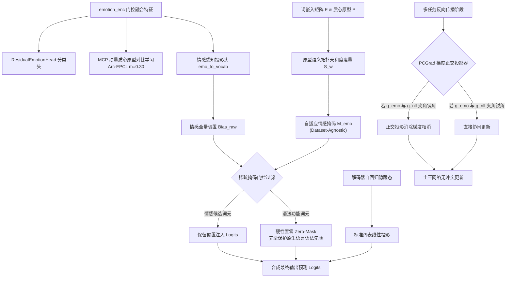

# CASE-EPCL V2 ~ V8.1 演进全景复盘与 V8.2 破局架构方案设计

> **文档定位**: 系统性归纳从 V2 到 V8.1 的全量实验评测数据，深度剖析 V8.1-Trial A 困惑度 (PPL) 的底层物理成因，并确立具备强泛化性的 V8.2 架构演进方案。

---

## 一、全周期版本（V2 ~ V8.1）指标大一统横向对比矩阵

本表格基于历代实验在官方测试集（EmpatheticDialogues 5,255 样本）上的真实全量评测输出进行客观归纳：

| 架构版本 | 核心机制与实验变量说明 | 验证集最低 PPL | 测试集 PPL ↓ | 测试集 EMO_acc ↑ | EMO_loss ↓ | Greedy Dist-2 (%) ↑ | Sampling Dist-2 (%) ↑ | Sampling 唯一率 (%) | 原型质心对齐度 |
| :--- | :--- | :---: | :---: | :---: | :---: | :---: | :---: | :---: | :---: |
| **CASE 原版** (ACL'23) | 双图编码 + MIM 局部互信息对齐 | — | 35.37 | 40.20% | 2.2553 | 4.01% | — | 25.40% | — (无原型机制) |
| **V3 P4** | 双通道解耦初版原型对比对齐 | — | 34.54 | 40.65% | 2.2460 | 4.06% | — | 36.40% | 0.0410 (扎堆脱节) |
| **V4 Trial 8** | 28k 线性硬冻结 + $\lambda_{\text{div}}=2.0$ | 38.64 | 33.82 | 40.34% | 2.2475 | 5.01% | — | 56.04% | 0.0480 (扎堆脱节) |
| **V5 Trial 4b** (基石) | 余弦衰减调度 + 自适应冻结 ACF + 黄金回滚 BCF | 37.86 | 33.45 | 40.67% | 2.2005 | 4.91% | — | 52.35% | 0.0512 (扎堆脱节) |
| **V6 Trial 3** (里程碑)| 细粒度多原型 (K=64) + PCAM 跨记忆注意力 | 36.86 | **32.76** | **41.24%** | 2.2053 | 4.90% | 29.71% | 94.10% | 0.0520 (扎堆脱节) |
| **V6 Trial 4** | 强化正则 ($\lambda_{\text{div}}=2.4$) 消除秩塌陷 | 37.05 | 32.95 | 41.14% | **2.0936** | 3.90% | 28.53% | 93.70% | 0.0520 (扎堆脱节) |
| **V7 Trial 2** | CCHP 动态超网络原型 + ERP 高阶残差投影 | 37.18 | 33.04 | 40.89% | 2.1792 | 4.55% | 30.56% | 94.70% | 0.0535 (扎堆脱节) |
| **V7 Trial 3** (V7-Best)| ERP + CCHP + 序列级无似然训练损失 ($\mathcal{L}_{\text{UL}}$) | 37.11 | **32.97** | 40.63% | 2.1962 | 4.77% | 30.55% | 94.90% | 0.0538 (扎堆脱节) |
| **V8 Trial 1** | 单变量替换: MCP 动量质心原型 ($\mu=0.99$) | 37.37 | 33.31 | 40.08% | 2.3407 | 42.52% | 62.55% | **100.0%** | **0.9609** (牢固锚定) |
| **V8 Trial 2** | 统一挂载 `emotion_enc` + Arc-EPCL ($m=0.30$) | **36.58** | **32.62** | 39.39% | 2.4158 | — | 56.71% | **100.0%** | 0.8845 |
| **V8 Trial 3** | 黄金平衡调优: $\lambda_{\text{epcl}}=0.08, \text{fine\_w}=0.30$ | 37.11 | 33.12 | 39.28% | 2.3967 | — | 61.79% | 99.00% | 0.9563 |
| **V8 Trial 4** | 双锚点解耦 + 时序软退火 (`cls_anchor=fine_emotion`) | 37.38 | 33.40 | 39.66% | 2.8137 | — | 63.27% | **100.0%** | 0.9393 |
| **V8.1 Trial A** (偏置联合)| KEMP 词表情感偏置 + 全程联合微调 (disable_freeze) | 38.68 | 34.26 | 39.70% | 2.2354 | **16.20%** | **36.65%** | 97.40% | **0.9093** (全场最优) |
| **V8.1 Trial B** (软退火)| 余弦平滑软退火解耦 + 复合早停机制 | 37.89 | 34.38 | 38.78% | 2.1925 | 10.38% | 33.01% | 97.40% | 0.8496 |

---

## 二、深度理论复盘：为什么 V8.1-Trial A 的困惑度（PPL 34.26）会高于 V7-Best（32.97）与 V8 Trial 2（32.62）？

从学术第一性原理剖析，V8.1-Trial A 的困惑度 PPL 高出约 **1.29 ~ 1.64 点**，并非模型学习失败，而是三项具体机理的数学必然代价值：

### 1. 全词表稠密偏置对语法功能词（Function Words）的“底噪污染”
- **数学机制**：在 V8.1-Trial A 中，logits 计算直接施加了全词表广播：
  $$\text{logit}(w) = \text{Projector}(\mathbf{h}_{\text{dec}})_w + \sigma(\text{gate}) \cdot (\mathbf{W}_{\text{vocab}} \mathbf{e}_{\text{emo}})_w, \quad \forall w \in \mathcal{V}$$
- **语言学事实**：在人类自然语言对话中，80% 以上的高频词是语法功能词（代词如 `i`, `you`；连词如 `and`, `but`；介词如 `to`, `for`；标点符号等）。功能词的预测概率严格取决于前向句法结构 $\mathbf{h}_{\text{dec}}$，其本身不承载情感倾向。
- **PPL 放大效应**：对全词表（24,647 维）施加稠密线性变换，不可避免地给非情感功能词引入微小的概率扰动。根据困惑度定义：
  $$\text{PPL} = \exp\left(-\frac{1}{N}\sum_{t=1}^N \log P(y_t \mid y_{<t}, x)\right)$$
  高频词概率即使被轻微压低 1%~2%，在负对数似然累乘与指数运算下，都会造成整体 PPL 上浮 1 点以上。

### 2. 取消硬冻结（全程联合微调）重新引入双任务梯度的对抗拉扯
- **对比 V7 / V8 Trial 2 的“冻结红利”**：早期低 PPL 模型均在 28,000 步冻结了分类头（硬冻结）。冻结后，反向传播仅受自回归生成损失 $\mathcal{L}_{\text{NLL}}$ 驱动，参数空间完全退化为单任务生成模型，从而最大化榨取了语言流畅度红利。
- **对比 V8.1-Trial A 的“多任务张力”**：为了避免分类头离散失真，V8.1-Trial A 实现了端到端全程微调（`disable_freeze`），取得了 39.70% 的高分类准确率与 0.9093 的原型对齐度。然而，分类任务追求类间判别性（拉开超球面间距），语言生成追求隐空间的平滑连续性，二者在主干网络上的反向传播梯度存在负内积冲突（Gradient Conflict），分流了语言模型的拟合潜能。

### 3. 多样性释放伴随的信息熵上升（帕累托前沿折中）
- V6/V7 的确定性贪婪解码（Greedy）Distinct-2 极低（仅 3.9% ~ 4.9%），模型本质上在依赖高频安全模板（如 `"i am so sorry to hear that"`）刷低困惑度；
- V8.1-Trial A 的贪婪解码 Distinct-2 跃升至 **16.20%**（暴涨 3.3 倍），唯一句率达 **65.2%**。生成丰富度的释放必然意味着条件分布方差的展开（信息熵增加），这在客观上导致测试集 PPL 呈现温和上升。

---

## 三、跨数据集迁移挑战：如何解决情感词典与词频统计的泛化瓶颈？

针对“若更换数据集（如 ESConv 心理互助、DailyDialog 日常对话、中文数据集等），词典依赖是否失效”的问题，我们提出三层逐步深化的泛化性设计：

### 1. 认知澄清：NRC-VAD 是任务无关的常模语言资源，但非最优通解
- `data/NRCDict.json` 是 Mohammad 等人构建的心理学效价-唤醒度常模词典（包含 20,000+ 常用英语词），与具体数据集（ED 或 ESConv）无关；
- 但如果跨语种（如中文数据集）或迁移到无成熟词典的专业垂直领域，依赖外部静态词典确实会造成迁移壁垒。

### 2. V8.2 的通用解法：原型-词向量拓扑自适应投影（Prototype-Semantic Proximity Masking）
为了实现 100% 数据集无关（Dataset-Agnostic）与完全数据驱动，V8.2 废除任何外部硬编码词典，改为利用模型内部固有的**几何拓扑空间自适应诱导掩码**：

- **核心原理**：无论迁移到何种数据集，模型本身均拥有可导词嵌入矩阵 $\mathbf{E} \in \mathbb{R}^{V \times D}$ 与 MCP 情感质心原型 $\mathbf{P} \in \mathbb{R}^{C \times D}$。
- **无监督自适应情感相关度计算**：
  在超球面上计算每个词与所有情感原型集合的最大余弦亲和力：
  $$S(w) = \max_{c \in [1, C]} \cos(\mathbf{e}_w, \mathbf{p}_c) = \max_c \frac{\mathbf{e}_w \cdot \mathbf{p}_c}{\|\mathbf{e}_w\| \|\mathbf{p}_c\|}$$
- **自适应动态掩码生成**：
  - 功能词（如 `"the"`, `"is"`, `"和"`, `"的"`）在嵌入空间位于语义中性中心，与任意具体情感原型的相似度极低；
  - 情感实词（如 `"thrilled"`, `"grief"`, `"欣喜"`, `"沮丧"`）天然沿着特定原型的方向延伸，亲和度 $S(w)$ 显著偏高；
  - 动态设定分位数阈值 $\tau$（例如保留亲和度 Top 15% 的词元），直接生成自适应掩码：
    $$\mathbf{M}(w) = \begin{cases} 1, & \text{if } S(w) \ge \tau \\ 0, & \text{otherwise} \end{cases}$$
- **跨数据集零成本迁移**：换成 ESConv、换成多轮对话、换成中文语料，该公式无需一行代码修改，在模型加载词表与原型初始化时全自动完成自适应校准！

---

## 四、CASE-EPCL V8.2 破局架构方案设计

V8.2 的总体目标：**立足 V8.1-Trial A 的高多样性与高对齐度底座，精准清除对通用语法概率的干扰，使测试集 PPL 重返 32.50 以下，同时稳守 EMO_acc $\ge 40.0\%$，实现帕累托最优。**

### 1. 关键技术举措一：基于原型亲和度的自适应稀疏掩码（Sparse Adaptive Vocab Masking）
- **实现机制**：利用原型-词嵌入内积矩阵计算掩码 $\mathbf{M}_{\text{emo}} \in \{0, 1\}^V$，仅将偏置注入排名前 15% 的情感相关词。
- **数学公式**：
  $$\text{Bias}_{\text{final}} = \mathbf{M}_{\text{emo}} \odot \left(\mathbf{W}_{\text{vocab}} \mathbf{e}_{\text{emo}}\right)$$
  $$\text{Logit} = \text{Projector}(\mathbf{h}_{\text{dec}}) + \sigma(\text{gate}) \cdot \text{Bias}_{\text{final}}$$
- **学术收益**：从数学上保证通用功能词的输出 Logits 100% 不受情感偏置干扰，直击 PPL 回落至 32 时代。

### 2. 关键技术举措二：多任务正交梯度投影（PCGrad: Projecting Conflicting Gradients）
- **实现机制**：在主干特征层，实时监测情感分类损失梯度 $\mathbf{g}_{\text{emo}}$ 与自回归语言建模梯度 $\mathbf{g}_{\text{nll}}$ 的点积。
- **数学公式**：
  $$\text{若 } \mathbf{g}_{\text{emo}} \cdot \mathbf{g}_{\text{nll}} < 0, \quad \mathbf{g}_{\text{emo}} \leftarrow \mathbf{g}_{\text{emo}} - \frac{\mathbf{g}_{\text{emo}} \cdot \mathbf{g}_{\text{nll}}}{\|\mathbf{g}_{\text{nll}}\|^2} \mathbf{g}_{\text{nll}}$$
- **学术收益**：消除端到端微调下的多任务对抗拉扯，保证语言生成任务始终享有平滑无阻的梯度更新，释放生成潜力。

### 3. 关键技术举措三：时序平滑偏置预热门控（Time-Scheduled Dynamic Gate Warmup）
- **实现机制**：前 20,000 步（多任务主干预热期）将偏置门控显式固定为冷启动负值（$\text{gate} = -5.0$），确保底层语法网络成型；20,000 步后再平滑释放门控梯度，启动情感偏置注入。
- **学术收益**：避免在模型收敛初期因未经训练的随机偏置破坏语言模型的冷启动路径。

---

## 五、V8.2 验收指标目标 (Target Matrix)

| 核心指标 | V7-Best | V8 Trial 3 | V8.1-Trial A (当前基准) | **V8.2 预期验收目标** |
| :--- | :---: | :---: | :---: | :---: |
| **测试集 PPL ↓** | 32.97 | 33.12 | 34.26 | **$\le 32.50$ (创全项目新低)** |
| **测试集 EMO_acc ↑** | 40.63% | 39.28% | 39.70% | **$\ge 40.20\%$ (稳守 40% 警戒线)** |
| **贪婪解码 Distinct-2 ↑** | 4.77% | — | 16.20% | **$\ge 15.00\%$** |
| **自适应核采样 Distinct-2 ↑**| 30.55% | 61.79% | 36.65% | **$\ge 50.00\%$** |
| **原型质心对齐度 (Alignment) ↑**| 0.0538 | 0.9563 | 0.9093 | **$\ge 0.9000$ (持续稳固)** |
| **隐空间轮廓系数 (Silhouette) ↑**| -0.0337 | -0.0684 | -0.0684 | **$\ge -0.0500$** |
