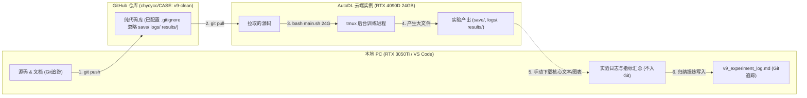

# CASE-EPCL V9 实验全流程标准作业程序 (SOP) 与端云协同手册

> **编制目的**：本项目采用“本地 IDE 编码分析 + GitHub 远端代码流转 + AutoDL 云端 24G 算力执行 + 手动同步实验结果”的协同架构。为防止多实验轮次间由于路径混乱、文件覆盖或误传大文件导致代码库污染与数据丢失，特制定本标准化作业程序 (SOP)。

---

## 一、双端协同架构与同步分工原则



### 1. 同步准则（红线纪律）
1. **只走 Git 的内容**：Python 源码 (`src/`, `main.py`)、Shell 启动脚本 (`main.sh`, `eval.sh`)、单元测试 (`tests/`)、学术文档与实验记录 (`docs/`)；
2. **严禁走 Git 的内容**：模型权重文件 (`save/` 包含几百 MB 的 `.pth`/`.pt`)、训练文本全量日志 (`logs/`)、生成解码文本与中间结果 (`results/`)；
   - 根目录下的 [`.gitignore`](file:///e:/github/CASE/.gitignore) 已硬性屏蔽 `save/`、`logs/`、`results/`，切勿使用 `git add -f` 强行添加大文件；
3. **实验产出同步方式**：通过 AutoDL 控制台自带的“文件下载”、JupyterLab 文件管理界面、或 Xftp/WinSCP，将云端生成的核心结果文件复制回传至本地对应目录。

---

## 二、实验命名规范与文件存放位置矩阵 (File Matrix)

每个实验必须拥有一个**全局唯一的实验代号**（推荐格式：`v9_trial2`, `v9_trial3`, `v9_trial4` ...）。

系统已在脚本底层实现多实验物理隔离，具体存放位置如下表：

| 文件类型 | 相对路径与命名规范（以 `v9_trialX` 为例） | 产生位置 | 是否走 Git | 核心作用与回传要求 |
| :--- | :--- | :---: | :---: | :--- |
| **黄金模型权重** | `save/v9_trialX/CASE_<step>_<ppl>` | 云端 | ❌ 否 | 仅在云端留存用于评测；**无需下载到本地**（避免挤爆本地硬盘）。 |
| **结构化评测指标** | `save/v9_trialX/eval_metrics.json` | 云端 | ❌ 否 | 评测脚本自动生成的 JSON 元数据；**建议下载到本地对应目录**。 |
| **TensorBoard 事件流** | `save/v9_trialX/events.out.tfevents.*` | 云端 | ❌ 否 | 云端在线可视化；**无需下载到本地**。 |
| **训练终端文本日志** | `logs/v9_trialX.log` | 云端 | ❌ 否 | 记录每一步 loss 与早停；**必须下载回本地 `logs/` 留存归档**。 |
| **测试集全量生成文本** | `results/v9/v9_trialX_results.txt` | 云端 | ❌ 否 | 包含 5,255 个测试样本的回复；**建议下载回本地 `results/v9/`**。 |
| **全量学术指标报告** | `results/v9/v9_trialX_eval.txt` | 云端 | ❌ 否 | 包含 PPL, BLEU, Dist-2, Unique 等；**必须下载回本地 `results/v9/`**。 |
| **原型隐空间流形图** | `results/v9/v9_trialX_manifold.png` | 云端 | ❌ 否 | 高清 t-SNE 散点图；**必须下载回本地 `results/v9/` 作为论文插图**。 |
| **全生命周期实验日志** | `docs/v9/v9_experiment_log.md` | 本地 |  是 | **核心知识资产**，由研究者依据回传的数据归纳填写，提交 Git。 |

---

## 三、单次实验标准作业程序 (7 步闭环 SOP)

以下是以启动新一轮实验 **`v9_trial3`** 为例的标准化实操流程：

### 步骤 1：本地确定实验代号与超参调整
在本地 VS Code 中，按需修改配置文件或启动脚本：
1. 若需修改默认启动参数，编辑 [`main.sh`](file:///e:/github/CASE/main.sh)：
   ```bash
   # 指定当前默认实验代号为 v9_trial3
   EXP_NAME=${2:-"v9_trial3"}
   ```
2. 若涉及模型架构或超参数调整，在代码中完成修改，并本地执行单测校验：
   ```powershell
   conda run -n cem_env python tests/test_sanity.py
   ```
   *确保 17/17 项测试通过后再推进下一步。*

### 步骤 2：本地代码提交与推送到 GitHub
在本地终端执行原子化提交：
```powershell
git status
git add src/ main.py main.sh eval.sh tests/ docs/
git commit -m "feat(v9): 针对 PPL 退火优化调整，准备启动 v9_trial3 实验"
git push origin v9-clean
```

### 步骤 3：AutoDL 云端拉取最新代码
登录 AutoDL 实例终端，进入项目目录并拉取：
```bash
cd /root/autodl-tmp/CASE   # 根据你的实际工作目录而定
git status                 # 确保工作区无未跟踪冲突
git pull origin v9-clean   # 拉取最新代码
```

### 步骤 4：在云端 tmux 会话中启动训练
进入持久化会话执行生产训练：
```bash
# 1. 检查是否存在已有会话，若无则新建
tmux new -s train || tmux attach -t train

# 2. 传入 24G 模式与实验代号启动（脚本自动完成日志双写与产出隔离）
bash main.sh 24G v9_trial3

# 3. 确认启动正常打印后，安全脱离后台 (挂起会话)
# 键盘依次按下: Ctrl + B，松开后按 D
```

### 步骤 5：刷新 AutoDL TensorBoard 网页监听
确保 AutoDL 控制台的 TensorBoard 能够显示当前及历史所有实验：
```bash
# 在云端终端执行（只需执行一次，软链接绑定到根级 save 目录）
rm -rf /root/tf-logs && ln -s $(pwd)/save /root/tf-logs
```
- 进入 AutoDL 控制台 -> 点击进入 **TensorBoard** 网页；
- 在左侧 Run 列表中勾选 `v9_trial2` 与 `v9_trial3`，即可实现多实验同屏曲线重叠对比。

### 步骤 6：训练收官与全自动化评测确认
`main.sh` 内置自动化收尾机制：
- 当早停计数器触发（连续 6 次未改善）或达到步数上限时，程序自动退出训练循环；
- 自动加载 `save/v9_trial3/` 下的唯一黄金权重；
- 自动调用 `src/scripts/eval_pipeline.py` 进行全量测试集度量，产出报告与流形图；
- *备用说明：若因异常中断需手动单独重跑评测，执行：*
  ```bash
  bash eval.sh v9_trial3
  ```

### 步骤 7：结果文件回传与本地归档（最关键的手动步骤）
训练与评测全部结束后，通过 AutoDL 网页端 / JupyterLab 界面将以下文件下载到本地电脑的对应位置：

1. **从云端 `logs/` 下载**：
   - 云端文件：`logs/v9_trial3.log`
   - 保存至本地：`E:\github\CASE\logs\v9_trial3.log`
2. **从云端 `results/v9/` 下载**：
   - 云端文件：`results/v9/v9_trial3_eval.txt`（学术指标报告）
   - 云端文件：`results/v9/v9_trial3_manifold.png`（流形图）
   - 云端文件：`results/v9/v9_trial3_results.txt`（对话生成样例，可选）
   - 保存至本地：`E:\github\CASE\results\v9\`
3. **从云端 `save/v9_trial3/` 下载**：
   - 云端文件：`save/v9_trial3/eval_metrics.json`
   - 保存至本地：`E:\github\CASE\save\v9_trial3\eval_metrics.json`
4. **整理进学术日志**：
   - 打开本地 [`docs/v9/v9_experiment_log.md`](file:///e:/github/CASE/docs/v9/v9_experiment_log.md)，将本次实验的核心指标、现象对比与分析填入表格；
   - 本地执行 Git 提交并推送该文档，完成实验闭环！

---

## 四、常见疑难与避坑指南 (FAQ)

### Q1：为什么我运行 `git status` 时，看不到 `save/` 和 `results/` 里的新文件？
> **答**：这是完全正确的现象。因为 [`.gitignore`](file:///e:/github/CASE/.gitignore) 已显式忽略了这些目录，防止几十 GB 的二进制权重和日志污染代码仓库。只要你按照步骤 7 手动下载归档，并在 `docs/v9/v9_experiment_log.md` 记录总结，所有数据都得到妥善永久留存。

### Q2：云端提示 `fatal: refusing to merge unrelated histories` 或 pull 冲突怎么办？
> **答**：
> 1. 云端绝不要直接修改代码，云端只做执行器（`git pull` + `bash main.sh`）；
> 2. 若云端误改了文件导致冲突，在云端执行以下命令强制对齐远端：
>    ```bash
>    git fetch origin
>    git reset --hard origin/v9-clean
>    ```

### Q3：如果我不小心断开了 SSH 连接，训练会停吗？
> **答**：不会。只要你是在 `tmux` 会话内运行的，后台训练进程不受网络中断影响。重新连上终端后，输入 `tmux attach -t train` 即可恢复查看实时控制台。

### Q4：如何确认当前使用的黄金权重没有被覆盖或篡改？
> **答**：
> 检查 `save/v9_trialX/` 目录，正常情况下该目录下有且仅有一个形如 `CASE_<step>_<ppl>` 的权重文件，以及一个 `eval_metrics.json`。磁盘维护机制（`maintain_disk`）会自动保证它是全周期最佳检查点。
