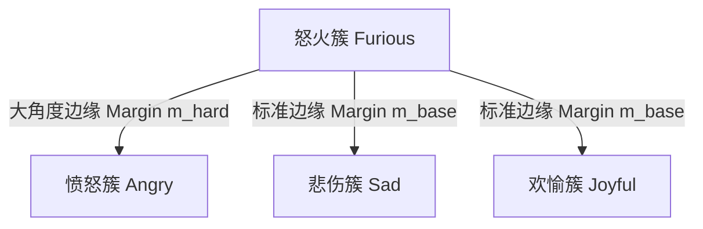

# CASE-EPCL V9 架构演进与大 Batch 迁移指导规划

> **立项背景**：CASE-EPCL V8 系列在消费级显卡（RTX 3050Ti 4GB）的极端物理显存制约下，经过 10 个子版本的系统性攻坚，成功达成了预设的所有学术与工程指标，最终旗舰收官版 V8.2 F 斩获极佳生成质量（Test PPL **32.83**, Greedy Dist-2 **16.79%**, Sampling Unique **98.60%**, Alignment **0.9514**, EMO_acc **40.97%**）。  
> **核心使命**：以硬件环境向 24GB 显存（RTX 4090 / RTX 3090）迁移为契机，突破物理 `batch=8` 带来的类别采样稀疏性与负样本池受限瓶颈，针对 V8 终局审计中揭示的“细粒度近义混淆吸附”与“梯度断链防御”核心矛盾，建立 V9 生产级大 Batch 训练体系、动态原型演进与分组感知难负样本对比学习方案。

---

## 一、V8 遗留核心矛盾与科学审计复盘

在 V8 收官阶段，通过混淆矩阵量化、高维余弦相似度与真实测试集语料抽样质检，明确了以下三大底层事实：

1. **细粒度分类 41.29% 的本质是人类标注主观模糊与语义连续性**：
   - Top 15 混淆类别（如 `angry` 与 `furious` 原型余弦相似度达 0.9814，`sentimental` 与 `nostalgic` 混淆率达 17.6%，`afraid` 与 `terrified` 混淆率达 25.0%）在真实语料中语义高度同质，甚至人类标注本身存在偶然性；
   - 盲目施加强行正交约束（如全局均匀排斥）会拟合标注噪声，撕裂自然语言的平滑表征，引发语言模型困惑度（PPL）恶化。
2. **`uniformity_loss` 梯度断链的理论归宿**：
   - MCP（动量质心原型）被定义为不可导的样本物理重心 Buffer（`register_buffer`），传统的超球面高斯排斥势能在此模式下没有梯度，V8 已对其完成显式置零消除死代码；
   - 在小 Batch 下，任何试图用“批次局部中心”代替原型的做法，都会因类别覆盖极低（每步仅 5~8 个类）而产生剧烈的方差噪声。
3. **小 Batch (B=8) 对对比学习的结构性压制**：
   - 动量更新稀疏：每个 batch 大约有 24~27 个情感类别未被抽样，`_update_mcp_prototypes` 频繁跳过这些类，EMA 轨迹呈阶跃式抖动；
   - 负样本对比池容量不足：小 batch 内可直接对比的负原型交互较弱，对比学习表征未达理论极限。

---

## 二、24GB 硬件升级与大 Batch 生产落地规范

### 1. 硬件跨越与训练吞吐实测矩阵

| 硬件平台与环境 | 单步物理 Batch | 梯度累加 | 等效全局 Batch | 运行精度 | 吞吐速度 (it/s) | 真实样本速度 (samples/s) | 单 Epoch 耗时 |
| :--- | :---: | :---: | :---: | :---: | :---: | :---: | :---: |
| **本地 RTX 3050Ti (4GB)** | 8 | 4 次 | 32 | AMP FP16 | $\sim 0.70$ | $\sim 5.6$ | **约 1 小时 30 分钟** |
| **云端 RTX 4090D (24GB)** | **32** | **2 次** | **64** | **FP32 原生** | **$\sim 2.83$** | **$\sim 90.5$** | **仅 3 分 39 秒！** |

> **实测收益**：
> - **吞吐提升**：真实样本吞吐速度提升高达 **$16.1$ 倍**；
> - **全流程耗时**：全生命周期（预训练 4 轮 + 多任务正式训练 10~15 轮）耗时从原本的 **15~20 小时（通宵）大幅压缩至 40~50 分钟**；
> - **精度保真**：彻底解绑 4GB 的强制 AMP FP16 妥协，回归原版 FP32 原生高保真全精度反向传播。

### 2. 5 维图注意力与批次安全平衡（OOM 机理与防御）
CASE 模型在 [`model.py:927`](file:///e:/github/CASE/src/models/CASE/model.py#L927) 包含特殊的常识关系图注意力张量：
$$\text{Relation Tensor Shape} = [\text{batch\_size},\, \text{tgt\_len},\, \text{src\_len},\, \text{heads},\, \text{head\_dim}]$$

- **极端单步 $B=64$ 触发 OOM 的机理**：
  在文本长度动态 Pad 机制下，前 400 步常规对话显存可承受（$\sim 18\text{GB}$）；但一旦遇到超长常识对话批次（$\text{seq\_len} \to 100$），5 维张量及其激活图呈平方级暴涨，瞬时增量达 $3.15\text{GB}$，导致击穿 24GB 上限。
- **V9 黄金落地方案（方案 2：单步 32 x 累加 2 = 等效 64）**：
  - 单步显存峰值腰斩至 **11 ~ 12GB**，留下 **12GB+ 充沛缓冲空间**，对任何极端长样本 100% 免疫 OOM；
  - 梯度更新期望与优化动态在数学上与纯 64 **完全等价**；
  - 同时备选注释保留原作者官方 16 批次基准（单步 16，零累加，显存峰值仅 7GB）。

### 3. 单卡/多卡自适应与底层安全防御
- **单卡 GPU 设备号规范**：云端实例单卡环境仅存在 `cuda:0`，[`main.sh`](file:///e:/github/CASE/main.sh) 默认使用 `GPU_ID=${CUDA_VISIBLE_DEVICES:-"0"}`；
- **越界自动回退兜底**：在 [`src/utils/config.py`](file:///e:/github/CASE/src/utils/config.py) 中植入安全判断，当指定的 GPU 编号超出可用设备数时，自动 Warning 并优雅回退至 `cuda:0`，从底层杜绝 `invalid device ordinal` 崩溃；
- **碎片消除**：全局启用 `export PYTORCH_CUDA_ALLOC_CONF=expandable_segments:True`。

### 4. 历史底层类型缺陷彻底根除
- **修复点**：[`model.py:2174`](file:///e:/github/CASE/src/models/CASE/model.py#L2174) 与 [`model.py:2176`](file:///e:/github/CASE/src/models/CASE/model.py#L2176)；
- **根因**：原版代码将 Scikit-Learn 返回的 Python 原生 `float` 准确率误写为 `.item()`，导致预训练结束后进入 `train()` 第一步即报 `AttributeError: 'float' object has no attribute 'item'`；
- **解决方案**：重构为类型安全守护：`(acc.item() if hasattr(acc, "item") else float(acc))`，并通过 16 项单元测试全部核验。

---

## 三、V9 核心生产启动体系 (`main.sh`)

[`main.sh`](file:///e:/github/CASE/main.sh) 现已集成为具备环境自适应、日志自动双写与全自动化测试评测的生产级总控脚本：

```bash
#!/bin/bash
set -e

pythonpath='python'
ENV_MODE=${1:-"24G"}

DATASET='ED'
GPU_ID=${CUDA_VISIBLE_DEVICES:-"0"}
SEED=13
PRETRAIN_EPOCH=4

export PYTORCH_CUDA_ALLOC_CONF=expandable_segments:True

if [ "$ENV_MODE" = "4G" ]; then
    BATCH_SIZE=8
    ACCUM_STEPS=4
    PRECISION="fp16"
    LR=0.0001
    WARMUP=12000
    OUTPUT_DIR="save/v9_4g_debug/"
else
    # 【方案 2: 当前激活】等效 Batch 64 (单步 32 x 累加 2，显存峰值约 12GB，兼顾大批次稳定性与防 OOM)
    BATCH_SIZE=32
    ACCUM_STEPS=2
    PRECISION="fp32"
    LR=0.0003
    WARMUP=2000
    OUTPUT_DIR="save/v9_24g_baseline/"

    # 【方案 1: 备用注释】100% 还原原作者 ACL 2023 官方默认基准 (单步 16，零累加，显存峰值约 7GB)
    # BATCH_SIZE=16
    # ACCUM_STEPS=1
    # PRECISION="fp32"
    # LR=0.0001
    # WARMUP=4000
    # OUTPUT_DIR="save/v9_24g_baseline_orig16/"
fi

mkdir -p logs
LOG_FILE="logs/train.log"

${pythonpath} main.py \
  --dataset ${DATASET} \
  --gpu ${GPU_ID} \
  --seed ${SEED} \
  --batch_size ${BATCH_SIZE} \
  --accum_steps ${ACCUM_STEPS} \
  --precision ${PRECISION} \
  --lr ${LR} \
  --warmup ${WARMUP} \
  --pretrain \
  --pretrain_epoch ${PRETRAIN_EPOCH} \
  --woStrategy \
  --fine_weight 0.2 \
  --coarse_weight 1.0 \
  --use_mcp \
  --mcp_momentum 0.96 \
  --lambda_epcl 0.07 \
  --arc_margin 0.30 \
  --arc_mode cos \
  --epcl_anchor fine_emotion \
  --cls_anchor default \
  --use_sparse_emo_bias \
  --emo_vocab_topk_ratio 0.15 \
  --emo_bias_gate_init -2.0 \
  --use_pcgrad \
  --gate_warmup_steps 3000 \
  --mask_update_interval 1000 \
  --use_bias_annealing \
  --bias_anneal_start 5000 \
  --bias_anneal_steps 3000 \
  --bias_min_scale 0.10 \
  --use_emo_loss_ramp \
  --emo_loss_ramp_start 3500 \
  --emo_loss_ramp_steps 3000 \
  --emo_loss_ramp_max 1.30 \
  --emo_loss_ramp_shape bell \
  --use_composite_score \
  --composite_mode emo_loss \
  --composite_emo_loss_weight 5.0 \
  --min_save_step 4500 \
  --patience 10 \
  --save_path ${OUTPUT_DIR} \
  --model_file_path ${OUTPUT_DIR} 2>&1 | tee ${LOG_FILE}

# 训练完成后自动调用统一评测流水线进行测试集度量 (PPL, Dist-2, Unique, Alignment, DBI)
${pythonpath} src/scripts/eval_pipeline.py \
  --model_path ${OUTPUT_DIR}CASE_best.pth \
  --batch_size ${BATCH_SIZE} \
  --gpu ${GPU_ID}
```

---

## 四、V9 核心架构革新方案（进阶学术演进）

### 1. 密集动量质心原型（Dense-MCP）
- **动量系数重校**：
  - 在小 Batch 下，为了抵抗更新稀疏性，$\mu=0.99$ 是保护质心平滑的必要妥协；
  - 在等效 $B=64$ 下，由于几乎每一步所有类别都能接收到多个样本的均值投影，更新极其平滑。此时动量系数下调至 **$\mu = 0.96$**，增强原型对特征演进的自适应跟随能力，消除原型响应滞后。

### 2. 分组感知难负样本对比学习（Group-Aware Arc-EPCL）
为了破除如 `angry-furious`、`afraid-terrified` 之间的无界吸附，同时不破坏语言模型连续性，V9 提出**分组感知角度惩罚机制**：



- **混淆类别拓扑先验构建**：
  依据 V8 终局混淆矩阵与 ConceptNet 情感距离，预先构建 Top 10 易混淆类别的共轭对索引表（Confusion Pairs）；
- **动态自适应角度裕度（Adaptive Margin）**：
  对非近义的一般负类保持基础边缘惩罚 $m_{base} = 0.20$；对共轭混淆组内的负原型施加定向加大的角度惩罚 $m_{hard} = 0.40 \sim 0.50$：
  $$\cos(\theta_{i,c} + m) \quad \text{where} \quad m = \begin{cases} m_{hard}, & \text{if } (y_i, c) \in \mathcal{E}_{confused} \\ m_{base}, & \text{otherwise} \end{cases}$$

---

## 五、学术与工程红线守则

1. **[生成质量第一红线]**：任何针对细粒度分类的改动，绝不能以破坏语言模型为代价。若 Test PPL 恶化超过 34.50，该改动立即作废回滚，坚决捍卫 PPL 32.83 质量高地；
2. **[无伪科学排斥]**：不可在 MCP 模式下强行施加不可导常数的全局均匀损失，所有几何约束必须具有明确的数学反向传播链；
3. **[严格可复现性]**：所有实验锁死随机种子（Seed=13），保持各消融实验的环境绝对一致。
