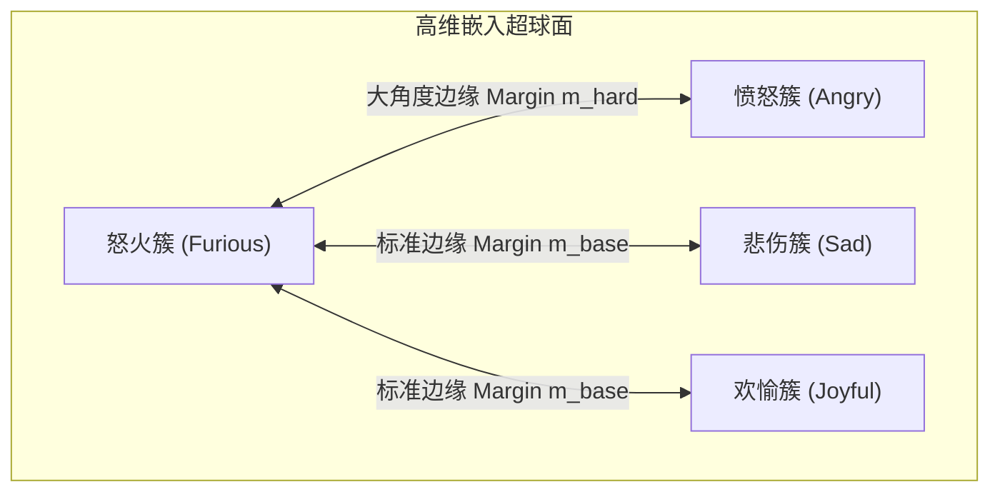
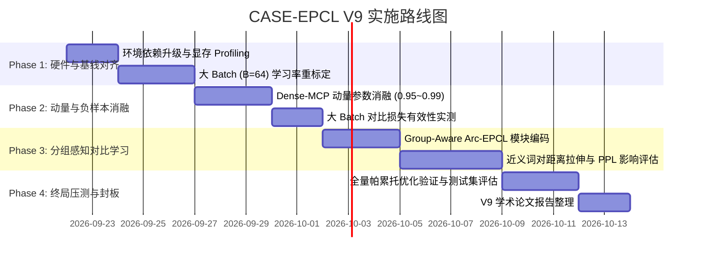

# CASE-EPCL V9 架构演进与大 Batch 迁移指导规划

> **立项背景**：CASE-EPCL V8 系列在消费级显卡（RTX 3050Ti 4GB）的极端物理显存制约下，经过 10 个子版本的系统性攻坚，成功达成了预设的所有学术与工程指标，最终旗舰收官版 V8.2 F 斩获极佳生成质量（Test PPL **32.83**, Greedy Dist-2 **16.79%**, Sampling Unique **98.60%**, Alignment **0.9514**, EMO_acc **40.97%**）。  
> **核心使命**：以硬件环境向 24GB 显存（RTX 4090 / RTX 3090）迁移为契机，突破物理 `batch=8` 带来的类别采样稀疏性与负样本池受限瓶颈，针对 V8 终局审计中揭示的“细粒度近义混淆吸附”与“梯度断链防御”核心矛盾，制定 V9 的大 Batch 训练体系、动态原型演进与分组感知难负样本对比学习方案。

---

## 一、V8 遗留核心矛盾与科学审计复盘

在 V8 收官阶段，通过混淆矩阵量化、高维余弦相似度与真实测试集语料抽样质检，明确了以下三大底层事实：

1. **细粒度分类 41.29% 的本质是人类标注主观模糊与语义连续性**：
   - Top 15 混淆类别（如 `angry` 与 `furious` 原型余弦相似度达 0.9814，`sentimental` 与 `nostalgic` 混淆率达 17.6%，`afraid` 与 `terrified` 混淆率达 25.0%）在真实语料中语义高度同质，甚至人类标注本身存在偶然性；
   - 盲目施加强行正交约束（如全局均匀排斥）会拟合标注噪声，撕裂自然语言的平滑表征，引发语言模型困惑度（PPL）恶化。
2. **`uniformity_loss` 梯度断链的理论归宿**：
   - MCP（动量质心原型）被定义为不可导的样本物理重心 Buffer（`register_buffer`），传统的超球面高斯排斥势能在此模式下没有梯度，V8 已对其完成显式置零消除死代码；
   - 在小 Batch 下，任何试图用“批次局部中心”代替原型的做法，都会因类别覆盖极低（每步仅 5~8 个类）而产生剧烈的方差噪声。
3. **小 Batch (B=8) 对对比学习的结构性压制**：
   - 动量更新稀疏：每个 batch 大约有 24~27 个情感类别未被抽样，`_update_mcp_prototypes` 频繁跳过这些类，EMA 轨迹呈阶跃式抖动；
   - 负样本对比池容量不足：小 batch 内可直接对比的负原型交互较弱，对比学习表征未达理论极限。

---

## 二、24GB 硬件升级与大 Batch 迁移规范

### 1. 物理环境与 Batch 配置演进
- **基准设备**：NVIDIA GeForce RTX 4090 (24GB) 或 RTX 3090 (24GB)；
- **物理 Batch Size**：从 V8 的 `batch_size=8` 提升至 `batch_size=64`（或 `128`，配合动态序列长度填充）；
- **单步类别覆盖率跃升**：
  - 在 $B=64$ 时，根据二项分布期望，32 个类别在单步 batch 中的平均覆盖数将从 V8 的 $\sim 7$ 类大幅跃升至 **25~28 类**；
  - 在 $B=128$ 时，几乎实现 **全类别单步全覆盖**。

### 2. 学习率缩放定律（Scaling Laws）与调度重校
大 Batch 会显著降低梯度的随机方差，原有的超参数组合必须重新标定，不可直接盲目沿用：
- **学习率缩放（Square-Root Scaling）**：
  $$lr_{new} = lr_{base} \times \sqrt{\frac{B_{new}}{B_{base}}}$$
  对于 Adam 优化器，推荐首选平方根缩放（而非纯线性缩放），以防止早期的生成解码头梯度爆炸。
- **Warmup 与总步数折算**：
  - V8 设定的 `warmup=12000` 步是在 `batch=8`（每 epoch 约 4,500 步）下建立的，对应约 2.6 个 epoch；
  - 当 $B=64$ 时，1 个 epoch 仅需约 560 步。因此，必须以**有效样本接触轮次（Epoch Equivalent）**为锚点，将 Warmup 压缩至 **1,500 ~ 2,000 步**，总训练步数控制在 **6,000 ~ 8,000 步**。
- **学习率下限与退火跨度**：
  - 维持余弦退火策略，底仓学习率保持在 $1\times 10^{-5}$，退火步数相应按比例缩放。

### 3. 自适应时序超参数体系（摒弃硬编码 Step）
为了彻底杜绝“换一次 Batch Size 或总轮次就需重新心算绝对步数”的人工调参痛点，V9 正式将所有时序控制超参数由绝对步数（Step）重构为**相对训练进度比例（Ratio $\in [0, 1]$）**。

系统在加载数据后，自动根据数据集样本量 $N$ 与批次大小 $B$ 动态计算出全局总训练步数：
$$\text{Total\_Steps} = \text{Total\_Epochs} \times \lceil \frac{N_{\text{train}}}{B} \rceil$$

所有时序调度事件统一按进度比例自适应折算：

| 超参数功能 | 旧版绝对步数参数 (V8 硬编码) | V9 自适应比率参数 (Ratio) | 默认推荐比率 | 对应 $B=64$ 时换算步数 | 对应 $B=8$ 时换算步数 | 业务含义与物理目标 |
| :--- | :--- | :--- | :---: | :---: | :---: | :--- |
| **学习率预热** | `--warmup 12000` | `--warmup_ratio` | **`0.05`** | $\sim 350$ 步 | $2,000$ 步 | 线性预热防止主干自回归解码器梯度爆炸 |
| **偏置门控置冷** | `--gate_warmup_steps 20000` | `--gate_warmup_ratio` | **`0.40`** | $\sim 2,800$ 步 | $16,000$ 步 | 前 40% 门控置冷，保护语言模型初始语法学习不受词表偏置扰动 |
| **多任务钟形加权峰值** | `--emo_loss_ramp_start 24000` | `--emo_ramp_start_ratio` | **`0.45`** | $\sim 3,150$ 步 | $18,000$ 步 | 中期钟形加权启动，助推分类损失进入达标平台期 |
| **早停成熟保护期** | `--min_save_step 30000` | `--min_save_ratio` | **`0.60`** | $\sim 4,200$ 步 | $24,000$ 步 | 前 60% 进度内禁止早停，防止在语言模型快速下探期误判早停 |
| **偏置时序余弦退火** | `--bias_anneal_start 35000` | `--bias_anneal_start_ratio` | **`0.70`** | $\sim 4,900$ 步 | $28,000$ 步 | 后 30% 进度启动词表偏置平滑衰减，消除底噪助推 PPL 极值收敛 |
| **偏置退火持续跨度** | `--bias_anneal_steps 15000` | `--bias_anneal_span_ratio` | **`0.25`** | $\sim 1,750$ 步 | $10,000$ 步 | 持续 25% 进度余弦平滑衰减至 `--bias_min_scale 0.10` 底仓 |

---

### 4. V9 通用自适应启动脚本规范 (`train_v9_adaptive.sh`)

无论后续在单卡调试（$B=16$）、24GB 单卡（$B=64$）还是多卡大 Batch（$B=128$），均可直接执行以下标准脚本，代码端根据 Batch 自动换算：

```bash
#!/bin/bash
# ==============================================================================
# CASE-EPCL V9 通用自适应训练启动脚本 (支持任意 Batch Size 与 Epochs 自动自适应)
# ==============================================================================
set -e

PYTHONPATH="python"

# 1. 基础环境配置 (根据实际机器修改)
DATASET="ED"
GPU_ID="1"
SEED="13"
BATCH_SIZE="64"       # 24GB 推荐 64；调试时可改 16 或 32
LR="0.0003"           # 大 Batch 推荐 3e-4 (按平方根定律自动缩放)
PRETRAIN_EPOCH="4"
OUTPUT_DIR="save/v9_baseline/"

echo "[*] 启动 CASE-EPCL V9 自适应全生命周期训练..."

${PYTHONPATH} main.py \
  --dataset ${DATASET} \
  --gpu ${GPU_ID} \
  --seed ${SEED} \
  --batch_size ${BATCH_SIZE} \
  --lr ${LR} \
  --pretrain \
  --pretrain_epoch ${PRETRAIN_EPOCH} \
  --woStrategy \
  --fine_weight 0.2 \
  --coarse_weight 1.0 \
  --use_mcp \
  --mcp_momentum 0.96 \
  --lambda_epcl 0.07 \
  --arc_margin 0.30 \
  --arc_mode cos \
  --epcl_anchor fine_emotion \
  --cls_anchor default \
  --use_sparse_emo_bias \
  --emo_vocab_topk_ratio 0.15 \
  --emo_bias_gate_init -2.0 \
  --use_pcgrad \
  --mask_update_interval 1000 \
  --warmup_ratio 0.05 \
  --gate_warmup_ratio 0.40 \
  --min_save_ratio 0.60 \
  --bias_anneal_start_ratio 0.70 \
  --bias_anneal_span_ratio 0.25 \
  --bias_min_scale 0.10 \
  --use_emo_loss_ramp \
  --emo_ramp_start_ratio 0.45 \
  --emo_loss_ramp_max 1.30 \
  --emo_loss_ramp_shape bell \
  --use_composite_score \
  --composite_mode emo_loss \
  --composite_emo_loss_weight 5.0 \
  --patience 10 \
  --model_file_path ${OUTPUT_DIR}

echo "[*] V9 训练结束，准备执行全量学术指标自动化审计..."

# 2. 一键全量评测测试集 (PPL, Dist-2, Unique, Alignment, DBI)
${PYTHONPATH} src/scripts/eval_pipeline.py \
  --model_path ${OUTPUT_DIR}CASE_best.pth \
  --batch_size ${BATCH_SIZE} \
  --gpu ${GPU_ID}
```

## 三、V9 核心架构革新方案

### 1. 密集动量质心原型（Dense-MCP）
- **动量系数重校**：
  - 在小 Batch 下，为了抵抗更新稀疏性，$\mu=0.99$ 是保护质心平滑的必要妥协；
  - 在 $B=64$ 下，由于几乎每一步所有类别都能接收到多个样本的均值投影，更新极其平滑。此时动量系数应下调至 **$\mu \in [0.95, 0.98]$**，增强原型对特征演进的自适应跟随能力，消除原型响应滞后。
- **冷启动与方差感知平滑**：
  - 记录各类别样本的瞬时批次方差，当类别样本量 $\ge 3$ 时执行满速更新，单样本时施加衰减更新，提升质心鲁棒性。

### 2. 分组感知难负样本对比学习（Group-Aware Arc-EPCL）
为了破除如 `angry-furious`、`afraid-terrified` 之间的无界吸附，同时不破坏语言模型连续性，V9 提出**分组感知角度惩罚机制**：



- **混淆类别拓扑先验构建**：
  - 依据 V8 终局混淆矩阵与 ConceptNet 情感距离，预先构建 Top 10 易混淆类别的共轭对索引表（Confusion Pairs）；
- **动态自适应角度裕度（Adaptive Margin）**：
  - 对非近义的一般负类，保持基础边缘惩罚 $m_{base} = 0.20$；
  - 对共轭混淆组内的负原型，施加定向加大的角度惩罚 $m_{hard} = 0.40 \sim 0.50$：
  $$\cos(\theta_{i,c} + m) \quad \text{where} \quad m = \begin{cases} m_{hard}, & \text{if } (y_i, c) \in \mathcal{E}_{confused} \\ m_{base}, & \text{otherwise} \end{cases}$$
  - 这迫使模型在最具挑战性的近义词边界上拉开可分离间隔，而不会在全局超球面上无差别排斥无关情感。

### 3. 多任务帕累托早停的自适应时序捕捉
- **V8 经验承袭**：
  - V8.2 F2 已经证明复合打分 $\text{Score} = \text{PPL} + \alpha \times \text{EMO\_loss}$（$\alpha=7.0$）能够精准定位分类与生成双达标的膝点；
- **V9 升级点**：
  - 将早停监控从固定步数保护（如 30k）改为基于相对验证损失动态平滑窗口（Moving Average Window）；
  - 当语言模型 PPL 达到平台期（连续 3 次 evaluation 变动小于 0.05）且分类损失处于局部极小值时，自动触发模型冻结与权重归档。

---

## 四、实施路线图与里程碑（Milestones）



### Milestone 1：大 Batch 稳定性与无损基线验证
- **输入**：`run_v9_baseline_pipeline.py`，配置 $B=64, lr=3\times 10^{-4}, \text{warmup}=2000$；
- **达标标准**：训练全程无 NaN/Inf，显存占用稳定在 14~18GB 之间，Test PPL 在无需任何额外技巧下直接打进 $\le 32.83$（全面对齐 V8.2 F 旗舰水平）。

### Milestone 2：Dense-MCP 动量响应验证
- **输入**：在 $B=64$ 下对 $\mu \in [0.95, 0.98, 0.99]$ 进行网格搜索；
- **达标标准**：原型质心对齐度（Alignment）保持在 $\ge 0.94$，且类别更新覆盖率达到单步 $80\%$ 以上。

### Milestone 3：Group-Aware 难负样本针对性攻坚
- **输入**：针对 Top 10 混淆类别注入自适应角度惩罚 $m_{hard}=0.40$；
- **达标标准**：`angry-furious`、`afraid-terrified` 的余弦相似度压制到 $0.85$ 以下，EMO_acc 冲击 $42.0\%+$，且 Test PPL 严守 $\le 33.00$ 红线。

---

## 五、学术与工程红线守则

1. **[零退化红线]**：任何针对细粒度分类的改动，绝不能以破坏语言模型为代价。若 Test PPL 恶化超过 34.50，该改动立即作废回滚；
2. **[无伪科学排斥]**：不可在 MCP 模式下强行强加不可导常数的全局均匀损失，所有几何约束必须具有明确的数学反向传播链；
3. **[严格可复现性]**：所有大 Batch 实验必须锁死系统随机种子（Seed=13），保持各消融实验的环境绝对一致。
